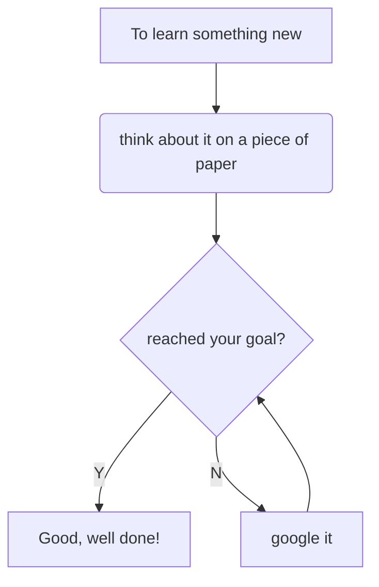

# Learning

## Silly example :smile:

### Learn fast something for quick usage:

- [ ] think about it on a piece of paper 
- [ ] read the documentation
  ex for SF -> google sf docs or google bookmark
- [ ] if not enough watch videos or examples and save shortcuts:
  ex. for SF ->  or  [youtube](https://www.youtube.com/results?search_query=)

* * *

* * *

\## The Art of #google-search

- keep it simple and gradually add search terms
- use descriptive words
- use words website would use:
  ex. "apex testing" instead of "how can i test apex"
- use shortcuts: 
  ex. weather \\<postcode> or time \\<city>
  - search a specific fieltype:
    ex. apex cheatsheet filetype:pdf
- use tabs present on search result page to filter
- use quote to restrict result: 
  ex. "\\<apex code snippets>"
- omit some result: \\<searched world> -\\<to omit>
  ex. mustang -cars
- search specific websites: \\<searched world> site:\\<website url>
  ex. apex snippets site:<https://developer.salesforce.com/>
- find a page that link to a specific page/result
  ex. link:"Tim Berners Lee" or link: link:cristiancaratti.co.uk
- find sites that are similar to others
    ex. related:amazon.co.uk

## Search fast in a Unix-like OS

- ag [file-type][options] PATTERN [PATH]
  ex. ag readme -l -i -G ec$ 
  Basically, search all files that contain 'readme' and that finishes in ec

