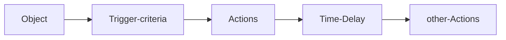
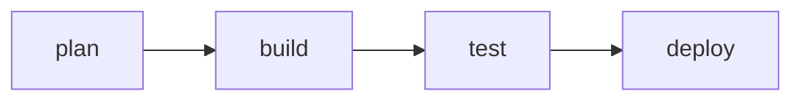

# Platform App Builder

<details><summary>
Study reference:
</summary>

Sources:
[Trailmix](https://trailhead.salesforce.com/users/strailhead/trailmixes/prepare-for-your-salesforce-platform-app-builder-credential)
[Trailhead exam prep](https://trailhead.salesforce.com/en/content/learn/trails/platform-app-builder-certification-prep)
[Salesforceben](https://www.salesforceben.com/platform-app-builder-certification-guide-tips/)

</details>

* * *

# Modules:

## **Salesforce Fundamentals** 8%

### [Lightning Experience Customization](https://trailhead.salesforce.com/content/learn/modules/lex_customization?trailmix_creator_id=strailhead&trailmix_slug=prepare-for-your-salesforce-platform-app-builder-credential)

<details><summary>
What is an AppExchange solution?
</summary>


</details>
<details><summary>
Managed or Unmanaged Packages?
</summary>
In Managed Packages elements/components can be upgradeable
</details>
<details><summary>
AppExchange use cases?
</summary>
General, functional, Industry-specific
</details>
<details><summary>
Which types of Accounts do you know?
</summary>
Business Accounts (B2B)
Personal Accounts (B2C)
</details>

<details><summary>
What is a Lightning App?
</summary>
 is a collection of items that work together to serve a particular function. In Lightning Experience, Lightning apps give your users access to sets of objects, tabs, and other items all in one convenient bundle in the navigation bar.
</details>

<details><summary>How to make a Lightning App?
</summary>
go to Setup -> #App-Manager ->  #Lightning-App-Builder since this one is used to Custom Lightning pages fo Lightning X and mobile App.
</details>

<details><summary>
What are  (and what do) Compact Layouts?
</summary>

- Compact layouts control which fields your users see in the highlights panel at the top of a record.

- They also control the fields that appear in the expanded lookup card you see when you hover over a link in record details, and in the details section when you expand an activity in the activity timeline.
  
  Is available from:
   Setup -> Object Manager
  </details>

<details><summary>
Can I customize the Fields in Record Details?
</summary>
Yes, Setup -> Object Manager -> Page Layout and use the drag & drop functionality
</details>

<details><summary>
What about page layout?
</summary>

Page layout contain the important sections: Details and Related (fields).

- Page layout can be accessed from Setup -> object manager -> obj -> Page Layout...-> drag and drop.
- Now you need to assign the page layout to the Profile from Page Layout Assignment from the upper right.
  
  </details>

<details><summary>
What are custom links?
</summary>

Custom links can link to an external URL, such as [www.google.com](http://www.google.com), a Visualforce page, or your company’s intranet.

</details>

<details><summary>
Which three primary types of custom buttons and links that you can create?
</summary>

1. List button
2. Detail page link
3. Detail page button
   
   </details>

<details><summary>
What are Quick Actions and how to set them up?
</summary>
We have 2 types:

- Object-specific actions
- Global actions

Create a Object-specific actions:

1. Setup -> Buttons, Links, and Actions
2. add it to the Page-Layouts:
      Quick Actions is for the Classic and 
      Mobile & Lightning Actions is for Lightning experience.
      
   \-> select the Page Layout you want the action be added 
   \-> drag & drop the action where you want to see it

Create a Global Action:
 It lets users create a **_object-record_** no matter where they are in Salesforce. A global action is an ideal way to do this, because the global actions menu appears at the top of every page.

1. setup -> #Global-Actions ...
2. add the action:
   ```
   - go to: #Publisher-Layouts -> edit -> drag & drop
   
   ```
   </details>

* * *

### [Service Cloud for Lightning Experience](https://trailhead.salesforce.com/content/learn/modules/service_lex?trailmix_creator_id=strailhead&trailmix_slug=prepare-for-your-salesforce-platform-app-builder-credential)

<details><summary>
What is the #Service-Cloud?
</summary>
- #Service-Cloud is an easy-to-use customer service application that can help you provide and track excellent service.
- You can reach it from the #Service-Console
</details>
<details><summary>
How do you setup the #Service-Cloud?
</summary>

1. Automate #case-management
2. Add multiple channels
3. Capture knowledge
4. Expand efficiencies with AI
   </details>

<details><summary>
Which #Case-management-tools do you know?
</summary>

|                     |                                                                                                                                                 |
| ------------------- | ----------------------------------------------------------------------------------------------------------------------------------------------- |
| Queues              | Automatically prioritize your support team’s workload by creating lists from which specific agents can jump in to solve certain types of cases. |
| Assignment Rules    | Automatically assign incoming cases to specific agents so that the right people work on the right cases.                                        |
| Escalation Rules    | Automatically escalate cases to the right people when the cases aren’t solved by a certain time.                                                |
| Auto-Response Rules | Automatically send personalized email responses to customers based on each case’s details.                                                      |

</details>

<details><summary>
Which Case tools should I use?
</summary>

| Question                                                                       | Answer                                                                                     | Tool                       |
| ------------------------------------------------------------------------------ | ------------------------------------------------------------------------------------------ | -------------------------- |
| Do support agents work as a team on specific issues?                           | Yes, some agents work off a list of emails as they arrive from customers.                  | Queues                     |
| How is the support team structured?                                            | We have Gold and Platinum support teams. Platinum support shares a workload.               | Queues or assignment Rules |
| Do support agents work on specific products or have special skill sets?        | Some agents work on solar panel installation while others work on solar panel performance. | Assignment Rules           |
| Do cases need to escalate to someone if they’re not solved by a specific time? | Yes, we can’t have customers waiting more than 5 hours to get their issues solved.         | Escalation Rules           |
| Should customers receive automatic responses?                                  | Yes, we want customers to know that we received their issue and that we care about them.   | Auto-response Rules        |

</details>

<details><summary>
Which #Digital-engagement-tools do you know?
</summary>

1. email service
2. web form service
   [Learn to set them up in this trail](https://trailhead.salesforce.com/content/learn/modules/service_lex/service_lex_channels?trailmix_creator_id=strailhead&trailmix_slug=prepare-for-your-salesforce-platform-app-builder-credential)
   </details>

* * *

## **Data Modeling and Management** 20%

### [Leads & Opportunities for Lightning Experience](https://trailhead.salesforce.com/content/learn/modules/leads_opportunities_lightning_experience?trailmix_creator_id=strailhead&trailmix_slug=prepare-for-your-salesforce-platform-app-builder-credential)

<details><summary>
How do you #convert-lead?
</summary>


</details>

<details><summary>
mandatory fields on Lead?
</summary>
Name, LastName, Company, Lead Status
</details>

<details><summary>
mandatory fields on Opportunity?
</summary>
Name, Closed Date, Stage
</details>

<details><summary>
What is Contact Roles on Opportunity?
</summary>
Contact roles on opportunities tell you which contacts you’re dealing with and how each contact is related to the opportunity
</details>

<details><summary>
What is an #Opportunity-team?
</summary>

It helps team members work together and track the opportunity’s progress.

1. enable from: Setup -> Feature Settings -> Sales -> Opportunities -> Opportunity Team Settings
2. check if #Opportunity-team on the right side of opportunity exist
3. if yes, click the arrow down and choice what to do next
4. In #Edit-opportunity-splits add splits values
   </details>

<details><summary>
How you can visualize success?
</summary>
Uasing #path and #kanban
</details>

<details><summary>
mandatory fields on Account?
</summary>
Name
</details>

<details><summary>
mandatory fields on Contact?
</summary>
LastName
</details>

* * *

### [Data Modeling](https://trailhead.salesforce.com/content/learn/modules/data_modeling?trailmix_creator_id=strailhead&trailmix_slug=prepare-for-your-salesforce-platform-app-builder-credential)

### The Data Model

> - objects: standard, custom, external
>   - relationships: lookup, master-details, many-to-many(need a junction object), ==hierarchical== (between 'user' objects), external lookup, indirect lookup
>   - fields: stnd and custom

<details><summary>
What's a #Data-model?
</summary>
It's a representation of data in a way that make sense at humans.

 \#[design-data-model](https://help.salesforce.com/articleView?id=schema_builder.htm&type=5)

</details>

<details><summary>
What is a #SF-object and the difference between #Standard-object and #Custom-object?
</summary>

It's like a table in the database, where columns are #fields and rows are #records.

- \#Standard-object(s) are objects that are included with Salesforce. Common business objects like Account, Contact, Lead, and Opportunity are all standard objects.
- \#Custom-object(s) are objects that you create to store information that’s specific to your company or industry. 
  </details>

<details><summary>
What is an #external-object?
</summary>

Are used when data that reside externally needs to be viewed inside an org.


</details>

<details><summary>
What is Salesforce Connect?
</summary>

- Is a service used to connect to an external system and access and display its data using external objects.
- It uses the model Open Data Protocol service (OData 2.0|OData 4.0) that allow the creation and consumption of query-able and interoperable RESTful APIs in a standard way.
- setup external data source in Setup menu -> Integration -> External Data Source
- external object use the API suffix name convention: \_\_x
- it bypass Governor Limits
- data not copied into SF
- Limitations:
  - cannot create Record Types
  - Location | Text Area (Rich) not supported
  - no WF Rules and Triggers for external data
  - others (see [help docs link](https://help.salesforce.com/articleView?id=platform_connect_about.htm&type=5))


</details>

<details><summary>
Example External Lookup
</summary>


</details>

<details><summary>
Example Indirect Lookup Relationship
</summary>


</details>

<details><summary>
What are #object-relationships and what types of relationship do you know?
</summary>

==They're a #special-field-type that connect two objects together.==
\#Lookup-relationship let you 'look up' an object from another.
There's 2 types: #one-to-one and #one-to-many.

==#Master-detail-relationship are 'tighter' relationship.==
The master object controls certain behaviors of the detail object, like who can view the detail’s data.
The detail object highly dependent on the master. In fact, if a record on the master object is deleted, all its related detail records are deleted as well. 
In a #Master-detail-relationship the Master is always a #Standard-object and the detail is the #Custom-object.
The field is added always on the master side of the #Master-detail-relationship
Trailblazer Community docs on relationships: [link](https://help.salesforce.com/articleView?id=relationships_considerations.htm&type=5)

</details>

<details><summary>
What is and what you can do with the #Schema-builder?
</summary>

1. It's a tool that let you manage the #Data-model from the #Setup menu.
2. You can create Objects, fields, add relationship and all is visual and drag & drop
3. available for both Classic and Lightning
4. it does not add automatically to page layout (you need to edit it to display the fields)
5. You cannot create custom Encrypted fields, External/Indirect lookup, and Geolocation fields
6. Cannot create external objects, cannot print Schema

* * *

</details>

<details><summary>
Text (encrypted) fields?
</summary>
Must have the 'Require secure connections (HTTPS)' enabled.
</details>

<details><summary>
How to choose a relationship?
</summary>


</details>

<details><summary>
Considerations on changing field types
</summary>

[changing field types](https://help.salesforce.com/articleView?id=notes_on_changing_custom_field_types.htm&type=5)

1. Not possible to change data types of Standard fields
2. Good practice to change data types when field contain no data
3. 'Change field type' in setup -> Object -> on field page
   </details>

<details><summary>
Which field type I can choose?
</summary>


If I need to do any calculation...is a Formula field.

</details>

<details><summary>
What are geolocation fields?
</summary>
Are compound fields; made up of Latitude and Longitude fields. Are Read-only.
</details>

* * *

### [Data management](https://trailhead.salesforce.com/content/learn/modules/lex_implementation_data_management?trailmix_creator_id=strailhead&trailmix_slug=prepare-for-your-salesforce-platform-app-builder-credential)

<details><summary>
Which format file can I use to import/export data?
</summary>
Only #CSV
</details>

<details><summary>
How do you #Import-data?
</summary>
I can import #CSV files with those tools:
#Import-wizard
#Data-Loader
#Dataloader.io

| If you want to . . .                                                                                    | Import Wizards     | Data Loader/Dataloader.io |
| ------------------------------------------------------------------------------------------------------- | ------------------ | ------------------------- |
| Import fewer than 50,000 records.                                                                       | :white_check_mark: | :white_check_mark:        |
| Prevent duplicates when importing new records.                                                          | :white_check_mark: |                           |
| Choose whether or not to trigger workflow rules and processes.                                          | :white_check_mark: |                           |
| Load up to 5,000,000 records (Dataloader.io limit is 100MB/file or about 500,000 to 1,000,000 records). |                    | :white_check_mark:        |
| Load objects such as products or opportunities.                                                         |                    | :white_check_mark:        |
| Schedule imports.                                                                                       |                    | :white_check_mark:        |
| Save fields mappings for later use.                                                                     |                    | :white_check_mark:        |
| Export or delete data.                                                                                  |                    | :white_check_mark:        |
| can Insert, Update, Upsert                                                                              | :white_check_mark: |                           |


More info [link](https://trailhead.salesforce.com/content/learn/modules/lex_implementation_data_management/lex_implementation_data_import?trailmix_creator_id=strailhead&trailmix_slug=prepare-for-your-salesforce-platform-app-builder-credential) here
[Video-series on import](http://pages.mail.salesforce.com/gettingstarted/sales-cloud/import-export-data/)

</details>

<details><summary>
More on Data loader
</summary>

For import, if a picklist value doesn't exist and is:

- can be used only by admin
- restricted -> record is NOT imported
- unrestricted -> the record is imported but value not added
- at the end of operation, 2 CSV fields are provided for success and errors
  </details>

<details><summary>
More on Data Import Wizard
</summary>
Can import Account and Contacts, Lead, Solution, Campaign members, custom object records
</details>

<details><summary>
Importing Knowledge articles...
</summary>

- imported one at the time
- update zip file that contain: a .csv file | a property file | an html file
- FLS to 'allow editing the fields'
  </details>

<details><summary>
How do I #Export-data, even for #backup data?
</summary>

In a #CSV format with those official tools:

- \#Data-Loader
- \#Data-export-service (aka Data Export Wizard), accessible from #Setup menu -> #Data-export.
  ```
  - It can even scheduled: once every: 7 days | 29 days
  - for all objects
  - email with link to download a zipped .csv file | active for 48 hrs
  - can add Chatter file and SF CRM content
  - can include images, docs, and attchments
  ```
  It allows you to export data manually once every 7 days (for weekly export) or 29 days (for monthly export)
  </details>

<details><summary>
Can I transfer Data? And with which tools?
</summary>
From #Setup menu I can use #Mass-transfer-records to move data.
</details>

<details><summary>
Can I delete more records at once?
</summary>
I can mass delete records using the #Mass-delete-records.
</details>

<details><summary>
Can I hard delete files?
</summary>
#Hard-Delete option is available for Data Loader and skip the recycle bin.
</details>

<details><summary>
What about exporting reports?
</summary>

- user permission is required
- different encoding option available
- Format: .csv or #XLS
- mo limits on rows/columns number
- formatted join report can be exported in XLSX
  </details>

* * *

### [Picklist amministration](https://trailhead.salesforce.com/content/learn/modules/picklist_admin?trailmix_creator_id=strailhead&trailmix_slug=prepare-for-your-salesforce-platform-app-builder-credential)


<details><summary>
What are #Picklist(s)?
</summary>

Picklists are menus that expand to give users choices.
Is composet of:

- field
- value set
  We have three type of picklists:

1. **Standard**: the ones that are included in your Salesforce org before any customization.
2. **Custom**: the one you create to have custom picklist's behaviour
3. **Custom Multi-Select**: if you want the user be able to select more than one value
   and fields can have those properties:

- \#**Restricted-picklists** : doesn't let you add new values, even with APIs, the idea is to create consistency
- **#Dependent** or **#Controlling**: it's based on a selection from another picklist or a checkbox (the controlling value) on the same record

  |                                   | Standard Picklist  | Custom Picklist    | Custom Multi-Select Picklist |                    |
  | --------------------------------- | ------------------ | ------------------ | ---------------------------- | ------------------ |
  | Add/Remove from Page Layouts      | :white_check_mark: | :white_check_mark: | :white_check_mark:           | :white_check_mark: |
  | Delete from Your Org              |                    | :white_check_mark: | :white_check_mark:           | :white_check_mark: |
  | Set a Default Value               | :white_check_mark: | :white_check_mark: | :white_check_mark:           | :white_check_mark: |
  | Use a Formula for a Default Value |                    | :white_check_mark: | :white_check_mark:           | :white_check_mark: |
  | Can Select Multiple Values        |                    |                    | :white_check_mark:           | :white_check_mark: |
  | Can Add Values via Apps or API    | :white_check_mark: | :white_check_mark: | :white_check_mark:           | :white_check_mark: |
  | Can Be Restricted                 |                    | :white_check_mark: | :white_check_mark:           | :white_check_mark: |
  | Can Be a Dependent Picklist       |                    | :white_check_mark: | :white_check_mark:           | :white_check_mark: |

  </details>
  <br>
  <details><summary>
  How can I edit picklist values?
  </summary>

from #Setup menu -> #Object-manager -> Object -> Fields & relationship -> choose Picklist value -> Edit...
ex. here from trailhead: [link](https://trailhead.salesforce.com/content/learn/modules/picklist_admin/picklist_admin_manage?trailmix_creator_id=strailhead&trailmix_slug=prepare-for-your-salesforce-platform-app-builder-credential)

</details>

<details><summary>
What are #Global-set-values and what they let you to do?
</summary>

\#Global-set-value(s) are always #restricted and let you share the same picklist values with more than one picklist field.
**If not restricted, you will not be able to promote it.**
Two ways to use it:

1. from #Seutp menu -> #Picklist-value-sets -> new...
   then, on a Object -> Fields & relationship -> New -> Picklist -> Next -> now select The #Global-set-value that you want to use.
   \#Use-global-picklist-value-set
2. from #Seutp menu -> Object -> Fields & relationship -> choose a picklist -> Edit -> #Promote-to-global-value-set
   </details>

* * *

### [Duplicate Management](https://trailhead.salesforce.com/content/learn/modules/sales_admin_duplicate_management?trailmix_creator_id=strailhead&trailmix_slug=prepare-for-your-salesforce-platform-app-builder-credential)

<details><summary>
What can I do to avoid duplicate data?
</summary>

Identify if there're duplicate records, using the Duplicate Management; it helps you and your sales teams quickly and easily manage duplicates for:
Business accounts
Contacts
Leads
Person accounts
Records created from custom objects
Accessible from #setup menu:
\#Matching-rules
\#Duplicate-rules

| What It Is     | What It Defines                                                                                                                                                                                                                                                                                                                                                                                                                                                                                                                                                                              |
| -------------- | -------------------------------------------------------------------------------------------------------------------------------------------------------------------------------------------------------------------------------------------------------------------------------------------------------------------------------------------------------------------------------------------------------------------------------------------------------------------------------------------------------------------------------------------------------------------------------------------- |
| Matching rule  | The matching criteria to identify duplicate records.Salesforce comes with three standard matching rules: one for business accounts; one for contacts and leads, and another for person accounts. Creating other matching rules is a cinch. We show you how Maria does it in the next unit.                                                                                                                                                                                                                                                                                                   |
| Duplicate rule | When Salesforce engages matching rules and determines actions to take as it encounters duplicates.Depending on how you configure Duplicate Management, sales reps see an alert that they’re about to create a duplicate. Or your reps are blocked from creating the duplicate altogether. If your company started using Salesforce in Spring ’15 or later, we give you standard duplicate rules for business accounts, contacts, leads, and person accounts. If your company started using Salesforce in Winter ’15 or earlier, like Maria, you create the rules on your own, which is easy. |

You can create a #Report in order to check for duplicate records.
\#Setup -> #Report-types -> ... -> select as #Primary-object the #Duplicate-record-items/#Duplicate-record-sets

</details>

* * *

## **Security** 10%

[Who can see what series](https://salesforce.vidyard.com/watch/B1bQnMFg2VyZq7V6zXQjPg)

### [Data Security](https://trailhead.salesforce.com/content/learn/modules/data_security?trailmix_creator_id=strailhead&trailmix_slug=prepare-for-your-salesforce-platform-app-builder-credential)

<details><summary>
Which are the levels of Data Access? 
</summary>

1. Organization -> auth users, password policies, location and hours login limits, trusted IP ranges (using #Profile)
2. Objects: setting permission on an object, from #Profile or #Permission-sets
3. Fields: restrict level access
4. Records: record access determines which individual records users can view and edit in each object they have access to in their profile. First ask yourself these questions:

- Should your users have open access to every record, or just a subset?
- If it’s a subset, what rules should determine whether the user can access them?

You control record-level access in four ways.

```
- #Organization-wide-defaults
- #role-hierarchy
- #sharing-rules: found at #setup->#Security->#Sharing-Settings.
    You need to define a #Public-group
    - #Private
    - #Public-Read-Only
    - #Public-Read-write
    - #Controlled-by-Parent
- #manual-sharing
```


Changes in Security can be tracked in the Audit section:
\#setup -> #Security -> #View-Setup-Audit-Trail
Different view for profile from Dev Org and normal one.


</details>

<details><summary>
Keys Setup links:
</summary>

- users (profile + Permission Sets)
- Security -> Sharing Settings (for access ti Data)
- fields: go to the field from Obj manager and 'Set Field Level Security' 
  ```
  - visible or read-Only
  ```
  </details>

<details><summary>
VESTD access chart
</summary>


</details>

<details><summary>
Record Access Summary
</summary>


</details>

### [Identity Basics](https://trailhead.salesforce.com/content/learn/modules/identity_basics?trailmix_creator_id=strailhead&trailmix_slug=prepare-for-your-salesforce-platform-app-builder-credential)

<details><summary>
Which are three main features of Salesforce Identity?
</summary>

- Single sign-on (#SSO)
- Connected apps
- Social sign-on
- Two-factor authentication (#2FA)
- My Domain
- Centralized user account management
- User provisioning
- Identity Connect
- App Launcher

And they're already avaible on your Org.


</details>

<details><summary>
Which are the language of Identity?
</summary>
#Language-of-Identity

1. \#SAML: is the protocol that allow #SSO (When you want users to move seamlessly between Salesforce orgs and applications without logging in repeatedly). It's an #XML-based protocol
2. \#OAuth 2.0 , allow secure data sharing between applications
3. OpenID Connect, #OpenID-Connect is protocol that adds an authentication layer on top of OAuth 2.0 to enable secure exchange of user information.

| One Term                                                                                                                                             | That’s Easily Confused with This Term                                                                                                                                                                                               |
| ---------------------------------------------------------------------------------------------------------------------------------------------------- | ----------------------------------------------------------------------------------------------------------------------------------------------------------------------------------------------------------------------------------- |
| Authentication means who a person is. These days, authentication is often used as shorthand for authorization and authentication.                    | Authorization means what a person can do.                                                                                                                                                                                           |
| Protocol specifies the set of rules that enable systems to exchange information. Generally, the term protocol and standard are used interchangeably. | Standard is a specification, a set of industry practices that vendors agree to support. Often, a standard contains a protocol to specify how the companies implement the standard.                                                  |
| Username and password are what the user supplies to log in to a system.                                                                              | Credentials are basically the same thing.                                                                                                                                                                                           |
| Single sign-on (SSO) enables a person to log in once and access other apps and services without logging in again.                                    | Social sign-on enables a person to log in to an app using the credentials established with a social account like Google. That app accepts the Google credentials, and the user doesn’t have to create another account and password. |
| Identity provider is a trusted service that enables users to access other websites and services without logging in again.                            | Service provider is a website or service that hosts apps and accepts identity from an identity provider.                                                                                                                            |

</details>

* * *

## **Business Logic and Process Automation** 27%

<details><summary>
Automation diagrams
</summary>


</details>

Generic questions:

<details><summary>
What's a record type?
</summary>

Record type define the page layout, the picklist values, and business process for the assigned records.
Access is defined at the Profile and Permission Sets
Max 200 record types for object.

</details>
<details><summary>
Business process for which objects?
</summary>
Lead, Case, Opportunity, Solutions... and for custom objects
</details>
<details><summary>
Steps to create a ___ Process.
</summary>

- update Master Picklist (if you have to, ex. create new picklist values)
- create a business process (Setup -> Feature Settings -> "Category of Process" (Sale/Lead etc.) -> Type of Process)
- create a record type (selecting a business process)
- assign a page layout
  </details>

* * *

### [Formula & Validations](https://trailhead.salesforce.com/content/learn/modules/point_click_business_logic?trailmix_creator_id=strailhead&trailmix_slug=prepare-for-your-salesforce-platform-app-builder-credential)

[Formula & Validations Cheatsheet](assets/pdfs/SF_Formulas_Developer_cheatsheet_web.pdf)

<details><summary>
Why #formula-fields?
</summary>

To perform calculations.
example: what if you wanted to calculate how many days are left until an opportunity’s close date.
Object Manager -> Oppurtunity -> fields & relationship -> new -> formula -> next -> Field label add 'Days to Close' -> select Number -> next ... -> in the formula area type or choose fields available: 

```java
CloseDate - TODAY()
or
ADDMONTHS(date,num)
or
CURRENCYRATE(IsoCode)
```

</details>

<details><summary>
What's the #Power-of-one?
</summary>
It's used to count the number of #unique-objects in a report with hundreds of records.
</details>

<details><summary>
What are #roll-up summary fields?
</summary>

A Roll-Up Summary Fields (available on the master) display a value on a master record based on the values of records in a detail record.

it's READ-ONLY

Limitations:

- Max 25 roll-ups fields for object.
- No for lookup relationships.
- No cross-object support
- No Date formula support. (cannot use NOW() and TODAY() )

[Roll-up reference](https://trailhead.salesforce.com/content/learn/modules/point_click_business_logic/roll_up_summary_fields?trailmix_creator_id=strailhead&trailmix_slug=prepare-for-your-salesforce-platform-app-builder-credential)
Type | Description
\-----\|------------
COUNT | Totals the number of related records.
SUM | Totals the values in the field you select in the Field to Aggregate option. Only number, currency, and percent fields are available.
MIN | Displays the lowest value of the field you select in the Field to Aggregate option for all directly related records. Only number, currency, percent, date, and date/time fields are available.
MAX | Displays the highest value of the field you select in the Field to Aggregate option for all directly related records. Only number, currency, percent, date, and date/time fields are available.

</details>

<details><summary>
What are validation rules?
</summary>

Validation rules verify that data entered by users in records meet the standards you specify before they can save it.
It evaulate an expression that return a 'true' or 'false' value.
[Val. rules reference](https://trailhead.salesforce.com/content/learn/modules/point_click_business_logic/validation_rules?trailmix_creator_id=strailhead&trailmix_slug=prepare-for-your-salesforce-platform-app-builder-credential)

</details>

<details><summary>
Workflow Rules

</summary>

Action can be:

- time-dependent actions
- immediate actions

  WR, they can:
- send email alerts
- creating tasks
- update fields
- send outbound messages: (sent in XML via API message -SOAP)
  </details>

<details><summary>
When are WR evaluated?
</summary>

- record is created
- record is created, and every time it's edited
- record is created, and every time it's edited to subsequently meet criteria

How are criteria evaluated?

- Criteria a re met using: ==filter logic==
- ==formula evaluate to true==

</details>

* * *

## [Lightning Flow](https://trailhead.salesforce.com/content/learn/modules/business_process_automation?trailmix_creator_id=strailhead&trailmix_slug=prepare-for-your-salesforce-platform-app-builder-credential)

<details><summary>
What is Lightining Flow?
</summary>

It's a declarative process automation.
It includes: 

- Process Builder
- Flow Builder
  </details>

<details><summary>
Which Automation Tool Is Right for My Use Case?
</summary>

| Type of Business Process     | Description                                                                                                                                 | Available Tools                     |
| ---------------------------- | ------------------------------------------------------------------------------------------------------------------------------------------- | ----------------------------------- |
| Guided visual experience     | Business processes that need input from users, whether they’re employees or customers.                                                      | Flow Builder                        |
| Behind-the-scenes automation | Business processes that get all the necessary data from your Salesforce org or a connected system. In other words, user input isn’t needed. | Process Builder, Flow Builder, Apex |
| Approval automation          | Business processes that determine how a record, like a time-off request, gets approved by the right stakeholders.                           | Approvals                           |

[Which automation tools trailhead guide](https://trailhead.salesforce.com/content/learn/modules/business_process_automation/process_whichtool?trailmix_creator_id=strailhead&trailmix_slug=prepare-for-your-salesforce-platform-app-builder-credential)


</details>

<details><summary>
Process builder?
</summary>

Accessible from Setup -> Process Automation
 \#process-builder



</details>

<details><summary>
Flow builder?
</summary>

Accessible from Setup -> Precess Automation
\#flow-builder

</details>

<details><summary>
What are Approval Process?
</summary>

An #Approval-process automates how Salesforce records are approved in your org.
Similar to WR, the can:

- send email alerts
- creating tasks
- update fields
- send outbound messages
  remember:
- Once the recor di submitted for approval, it's locked for changes
- Often has:
  ```
  - 2 steps
  - approval + validation rule
  ```
  [quick trailhead reference for approval process](https://trailhead.salesforce.com/content/learn/modules/business_process_automation/approvals?trailmix_creator_id=strailhead&trailmix_slug=prepare-for-your-salesforce-platform-app-builder-credential)
  [Approval process docs](https://help.salesforce.com/articleView?id=approvals_checklist.htm&type=5)

</details>

* * *

## [Screen Flow Distribution](https://trailhead.salesforce.com/content/learn/modules/screen_flow_distribution?trailmix_creator_id=strailhead&trailmix_slug=prepare-for-your-salesforce-platform-app-builder-credential)

<details><summary>
When Flow need an #Flow-action on a record instead of as default?
</summary>

| Use Case                                                                                                                                                                                                                                                                                            | Example                                                                                                                                                                                                                                                                |
| --------------------------------------------------------------------------------------------------------------------------------------------------------------------------------------------------------------------------------------------------------------------------------------------------- | ---------------------------------------------------------------------------------------------------------------------------------------------------------------------------------------------------------------------------------------------------------------------- |
| The first element in the flow isn't a screen.The power of a flow is that it can do a lot of things behind the scenes, with the user none the wiser. But that can also make the flow a little bit dangerous, especially if it does those powerful, behind-the-scenes things before the first screen. | You built a flow that creates a task before displaying a screen to the user. If you put that flow on, say, the Account page, that flow would create a task every time a user loaded an account. That could result in lots of unnecessary tasks being created each day. |
| The flow isn't used often enough to be expanded by default.                                                                                                                                                                                                                                         | You created a flow for your office managers to order new supplies. The office managers need to be able to access that flow easily, but they don't need to order supplies every day, so it would be a waste of space to put the flow directly on a record page.         |

</details>

<details><summary>
Where Flow can be added if needed on more records?
</summary>

If flow needs to be added from more than 1 record, you can add it to the #utility-bar,
It's only on all pages of 1 App.

</details>

<details><summary>
Can I add the Flow outside of Salesforce Org?
</summary>

1. Yes, You can add it to the a Salesforce Lightning #Community on:
   - Surveys
   - Registration forms
   - Interest forms
   - Quote generators, such as for a car they're selling
2. You can add it to a external app using #Lightning-out, but first enable Communities in Setup.
   more info [here on this trailhead](https://trailhead.salesforce.com/content/learn/modules/screen_flow_distribution/screen_flow_distribution_external?trailmix_creator_id=strailhead&trailmix_slug=prepare-for-your-salesforce-platform-app-builder-credential)
   </details>

* * *

## [Lightning Experience Productivity](https://trailhead.salesforce.com/content/learn/modules/lightning-experience-productivity?trailmix_creator_id=strailhead&trailmix_slug=prepare-for-your-salesforce-platform-app-builder-credential)

<details><summary>
Tell me about some productivity tools?
</summary>

- shortcuts: [#shortcuts](https://trailhead.salesforce.com/content/learn/modules/lightning-experience-productivity/elevate-your-daily-productivity?trailmix_creator_id=strailhead&trailmix_slug=prepare-for-your-salesforce-platform-app-builder-credential)
- \#Notes and #files objects: you can add them to #related-lists from object manager -> Page Layouts -> ObjectName Layout -> select related Lists -> drag & drop the Notes/Files section in the Related Lists; [reference docs](https://help.salesforce.com/articleView?id=admin_files_related_list_setup.htm&type=5)
- \#Global-search and refine results with filters
- collaborate with #feeds and #groups 
  \-#reports and #dashboards, you can even share them in Chatter to ask for some questions you may have about them but first enable #feed-tracking in Setup. Now the icon for collaboration will be available on your reports and dashboards so you can use the collaborate feature and even mention your colleague: [trailhead reference here](https://trailhead.salesforce.com/content/learn/modules/lightning-experience-productivity/analyze-your-data-with-reports-and-dashboards?trailmix_creator_id=strailhead&trailmix_slug=prepare-for-your-salesforce-platform-app-builder-credential)
  </details>

<details><summary>
How can you migrate from Workflow rules to processes?
</summary>

[from Workflow rules to Processes trailhead](https://trailhead.salesforce.com/content/learn/modules/workflow_migration?trailmix_creator_id=strailhead&trailmix_slug=prepare-for-your-salesforce-platform-app-builder-credential)

1. map your criteria, map your actions, determines the order of your criteria

- Is a best practice use one automation tool for objects? yes, so I can predict for that object which are the possible behavior without getting crazy looking between many tools automated or not
  </details>

<details><summary>
When a #workflow-rule is evaluated?
</summary>

- created
- created or edited
- created or edited to subsequently meet criteria
  </details>

<details><summary>
In which order #workflow-rule run?
</summary>

==Workflow rules are always nondeterministic.==
In regular-person language: Salesforce can’t guarantee which workflow rule is evaluated first or second or seventh.

</details>

* * *

[#Process-Automation-Cheatsheet](/assets/pdfs/SF_Process_Automation_cheatsheet_web.pdf)

[Which automation tools should I used Complete guide docs](https://help.salesforce.com/articleView?id=process_which_tool.htm&type=5)

* * *

## **Social** 3%

### [Chatter Administration for Lightning Experience](https://trailhead.salesforce.com/content/learn/modules/lex_implementation_chatter?trailmix_creator_id=strailhead&trailmix_slug=prepare-for-your-salesforce-platform-app-builder-credential)

<details><summary>
Where to enable in Setup Social Accounts, Contacts, and Leads (the objs available for Socials)?
</summary>

- Feature Settings -> Sales -> Social Accounts and Contacts Settings
  </details>

<details><summary>
Which socials can SF connect to?
</summary>

- Twitter (on Lightning experience and Mobile app)
- YouTube (only on classic)
- can reply to Instagram comment from Social Publisher
  </details>

<details><summary>
What is Social Customer Service?
</summary>

Is a feature that enable users to interact with social users and create Leads and Cases from Social Media Pos
Classic Setup -> Social Customer Service

- Free Starter Pack can be used with FaceBook and Twitter
- Social Studio Account for YouTube and Instagram
- Can use Social Feed Tracking
  </details>

<details><summary>
What are Social Business Rules?
</summary>
Can be used to automate how inbound social content is processed and appears to support agents.
</details>

<details><summary>
What is Social Conversation?
</summary>
It's a feature that pull information from social account about customer, case context and insight from previous interactions.
</details>

<details><summary>
What is #Chatter?
</summary>
It's a Salesforce collaboration tool that help users to work efficiently across all the organization regardless of role or location.
</details>

<details><summary>
What #Chatter-groups? 
</summary>

Groups are the main collaboration space in Chatter.
It's an Object and it's visible in the Tab section on dropdown for Tabs. 
Types:

- public
- Private
- Unlisted
- Broadcast-only
  </details>

<details><summary>
What is #Field-tracking?
</summary>

[doc](https://help.salesforce.com/articleView?id=tracking_field_history.htm&type=5)
Feed tracking makes it easy to see changes to critical records anytime, anywhere. You can select up to 20 fields to track.

</details>

<details><summary>
How do you set field tracking?
</summary>

<https://help.salesforce.com/articleView?id=tracking_field_history_for_standard_objects.htm&type=5#hiddenTables:~:text=From%20the%20management%20settings%20for%20the,Click%20Set%20History%20Tracking>

1. From the management settings for the object whose field history you want to track, go to the fields area.
2. Click Set History Tracking
   </details>

<details><summary>
Can you use Chatter to #approval-process?
</summary>

Yes, An approval process maps the route that a record takes through the people who are aligned to provide approval. The approval process can send an approval request as a Chatter post. You can create a template for that post to ensure that the same type of data is posted with every request.
Steps:

1. Enable approval requests in Chatter.
2. Create an approval post template.
3. Create an approval process.
4. Enable feed tracking.
   </details>

<details><summary>
What is a #rollout-strategy for Chatter?
</summary>
It allow to prepare for the Chatter relaease and can count on #Champions (#Sponsors, #Evangelists and #Community-Managers)
The rollout can be #profile-based. A profile-based Chatter deployment can be useful to larger organizations because it allows for a controlled, department-by-department deployment
</details>

* * *

## **User Interface** 14%

## [Lightning App Builder](https://trailhead.salesforce.com/content/learn/modules/lightning_app_builder?trailmix_creator_id=strailhead&trailmix_slug=prepare-for-your-salesforce-platform-app-builder-credential)

<details><summary>
What is a Lightning Page?
</summary>

A Lightning page is a ==custom layout== that lets you design pages for use in the Salesforce mobile app or Lightning Experience. A Lightning page is composed of regions that contain components.

</details>

<details><summary>
What can you build with the Lightning App Builder?
</summary>

SPA, Dashboard style apps, App for solving a particular task, custom home and record pages
| header |
| toolbar |
| Lightnings Component Page | Lightning Page Canvas |Properties Pane |


</details>

<details><summary>
Which pages can you create in Lightning App Builder?
</summary>

- Home page
- App page
- Record page
- Embedded service page

</details>

<details><summary>
Can you use Lightning Components in a Lightning Page?
</summary>
Yes, you can create a component(s) using the Aura Component Model or the LWC model.
You can even install a package from the #AppExchange
</details>

* * *

## **Reporting** 5%

### [Reports & Dashboards for Lightning Experience](https://trailhead.salesforce.com/content/learn/modules/lex_implementation_reports_dashboards?trailmix_creator_id=strailhead&trailmix_slug=prepare-for-your-salesforce-platform-app-builder-credential)

<details><summary>
What is a Report?
</summary>
A report is a list of records (like opportunities or accounts) that meet the criteria you define.
To get the data you need, you can filter, group, do math on records and  even display them graphically in a chart.
</details>

<details><summary>
What is a Dashboard?
</summary>

A dashboard is a visual display of key metrics and trends for records in your org.
Each dashboard has a running user, whose security settings determine which data to display in a dashboard. If the running user is a specific user, all dashboard viewers see data based on the security settings of that user—regardless of their own personal security settings.

</details>

<details><summary>
How to choose a Component for the Dashboard?
</summary>

Componets can be:
 \-chart,gauge,metric,table... and Visualforce


</details>

<details><summary>
What is required for using a joined dashboard component?
</summary>

The joined report MUST have a chart

</details>

<details><summary>
What two permissions are needeed to create custom reports th at all users can view?
</summary>

1. Manage Public Reports
2. Create and Customize Reports
   </details>

<details><summary>
What is a report type?
</summary>

==Report types are predetermined combinations of related objects and their
records and fields that you use as starting points when building new custom reports.==

Choosing a report type, you’re picking the records and fields you’ll be able to see in your report.

If you add a related object, here’s how you can configure a report type’s object relationship:

- Primary object with related object—Records
- Primary object with or without related object

==We have 2 Report types:==

- Standard (ready-made so you don't need to do nothing but choose on wich obj/obj combo) ==with==
- Custom (setup -> Feature Serttings -> Analytics -> Reports and Dashboards -> Report Types) ==with or without== in add to the 1ry obj, you can add till 3 rel objs |(4 levels)
  </details>

<details><summary>
Questions to ask to create a custom report
</summary>


</details>

<details><summary>
Which Report formats do you know?
</summary>

| Report Format | Primary Use Case                                                   | Supported in Dashboards | Report Charts Supported | Bucket Fields\*\*  | Formulas\*\*       | Cross-Object Formulas\*\* |
| ------------- | ------------------------------------------------------------------ | ----------------------- | ----------------------- | ------------------ | ------------------ | ------------------------- |
| Tabular       | Make a list-No grouping                                            | :white_check_mark:      |                         | :white_check_mark: |                    |                           |
| Summary       | Group and summarize                                                | :white_check_mark:      | :white_check_mark:      | :white_check_mark: | :white_check_mark: |                           |
| Matrix        | Group and summarize, by row and column-analyzing large amount data | :white_check_mark:      | :white_check_mark:      | :white_check_mark: | :white_check_mark: |                           |
| Joined        | a mix of the previous                                              |                         |                         | no                 |                    |                           |

</details>

<details><summary>
What are dynamic dashboards?
</summary>

- With dynamic dashboards, each user sees the data they have access to without needing to create separate dashboards for each user.
- This means a single powerful dashboard can be used for multiple users in your company, because the logged-in user viewing the dashboard sees the data they should see, based on their security and sharing settings.
  </details>

<details><summary>
How do you choose between a chart for your Report and a Dashboard?
</summary>

I reckon, if I have only one report I can even add a chart, I think, so that is going to give me the graphical representation I need.

</details>

<details><summary>
What do you consider before create a dashboard?
</summary>

I don't want to reinvent the well, I can decide to visit the [AppExchange](https://appexchange.salesforce.com/) and look for a solution already there such as [#Salesforce CRM Dashboard](https://appexchange.salesforce.com/listingDetail?listingId=a0N30000004g316EAA)

</details>

<details><summary>
When are Dashboards refreshed?
</summary>

- Manually
- Scheduled: Daily, weekly or monthly
  </details>

### [Create Reports and Dashboards for Sales and Marketing Managers](https://trailhead.salesforce.com/content/learn/projects/create-reports-and-dashboards-for-sales-and-marketing-managers?trailmix_creator_id=strailhead&trailmix_slug=prepare-for-your-salesforce-platform-app-builder-credential)

<details><summary>
Can i create a structure where Reports and dashboards can be orginized and shared?
</summary>

Yes, go to Reports or Dashboards and go to All Folders, Created by Me etc. and go from there.

</details>

<details><summary>
How can I categorize further my Reports?
</summary>

You can use a buckets.(from Column section)
Bucketing lets you segment your report data on the fly by defining a set of categories, or “buckets,” to sort, group, or filter the record.


</details>

<details><summary>
What can you do more on your Reports data? 
</summary>

You can:

- Add Bucket Column 
- Add Summary Formula 
- Add Row Level Formula 
- Remove All Columns
  
  </details>

<details><summary>
Report subscription?
</summary>
A user can subscribe to max 5 reports at the time
- frequency can be set to daily,weekly, monthly + at specific time
</details>

<details><summary>
What are Report Snapshot?
</summary>

- They provide information on hisgtorical data by storing report data scheduled over a period of time
- Available for Summary and Tabular reports
  </details>

<details><summary>
Can you export reports?
</summary>

Yes, right click on :arrow_down_small:, -> export in .xlsx or .csv for second option, first one only .xlsx, and you're done!


</details>

[Lightning Experience Reports & Dashboards Specialist](https://trailhead.salesforce.com/content/learn/superbadges/superbadge-lex-rd?trailmix_creator_id=strailhead&trailmix_slug=prepare-for-your-salesforce-platform-app-builder-credential)

* * *

## Mobile 5%

[Salesforce Mobile App Customization](https://trailhead.salesforce.com/content/learn/modules/salesforce1_mobile_app?trailmix_creator_id=strailhead&trailmix_slug=prepare-for-your-salesforce-platform-app-builder-credential)

<details><summary>
We are going to see three features you can use to customize the mobile app.
</summary>

- Mobile navigation, for Lightning apps and the Mobile Only app
- Quick actions:
    Standard Actions -> Setup -> ...Global Publisher Layout
    Custom Actions -> from the Object manager -> Page Layout
    Default Actions
    Visualforce Pages
    Canvas Apps
    Mobile Smart Actions
    Productivity Actions
- Compact layouts
  </details>

<details><summary>
How and where I can set for the Mobile navigation?
</summary>


</details>

<details><summary>
How can I set #Global-actions on mobile?
</summary>

Setup -> Global actions -> create the action -> add the action to the Publisher Layouts (Edit) -> Drag & Drop the New Action to the Salesforce Mobile and Lightning Experience Actions

</details>

<details><summary>
How can you add a new Mobile custom Compact Layout?
</summary>

Setup -> Object Manager (select Object interested) -> Compact Layouts -> New (give it a name and select fields -> Save -> Compact Layout Assignment -> Edit Assignment...

</details>

* * *

## App Deployment 8%

[Build a Battle Station App](https://trailhead.salesforce.com/content/learn/projects/workshop-battle-station/battle-station-1?trailmix_creator_id=strailhead&trailmix_slug=prepare-for-your-salesforce-platform-app-builder-credential) 

1. Create the App container and tabs
   <details><summary>
   How to create an app?
   </summary>
   Setup -> App Manager
   for UI In can use: Setup -> Lightning App Builder ...
   </details>

2. Build the #Object-model
   Use the  #ER-diagrams (Entity Relationship model) to understand how objects links together and create #tabs and add #custom-fields to #custom-object

<details><summary>
How to create a #Master-detail relationship?
</summary>

The relationship is create on the #custom-object (detail) where you select the #Master where you want the App to appear.

</details>

<details><summary>
Ap Dev Lifecycle
</summary>



</details>

<details><summary>
Types of sandobox
</summary>

[Sandboxes and storage limits Doc page](https://help.salesforce.com/articleView?id=data_sandbox_environments.htm&type=5)

or


</details>

<details><summary>
What is Change Set?
</summary>
It's a way to deploy customizations.
They only move metadata, not actual data
</details>

<details><summary>
How to deploy Metadata with Change Sets?
</summary>


</details>

<details><summary>
How can I create a Package (unmanaged only in dev org)?
</summary>
Setup -> Apps -> Packaging -> Package Manager (Packages -> new)
</details>

<details><summary>
Use cases Unmanaged Packages?
</summary>


</details>

<details><summary>
Alternative routes to Change Sets?
</summary>

- VSCode
- Ant Migration Tool
- Specific Package/App from AppExchange
  </details>

<details><summary>
Best practices before deployment of Change Sets?
</summary>

- Plan and announce a maintenance window
- Validate Change Sets
- Lock out users from Production (basically, updating login hours on profiles - NOT the admin though :sweat_smile: or create a maintenance user profile (temporarely)
- verify functional changes
- unlock users by reset original loggin hours... :+1:
  </details>

* * *

## Starting review process

==The following trail contain flshcards and interesting questions==

- [x] 2020-11-10 10:49 [Study for the Platform App Builder Exam](https://trailhead.salesforce.com/en/content/learn/trails/platform-app-builder-certification-prep?trailmix_creator_id=strailhead&trailmix_slug=prepare-for-your-salesforce-platform-app-builder-credential)

<details><summary>
Concepts not clear to review later:
</summary>

- [ ] look-up relationship for external object -> direct | indirect lookup
- [ ] security in general; still not 100% correct in understanding how to give right permission/profile etc to share etc. specifically look out for criteria-based sharing rules...
- [ ] what's a group?
- [ ] sharing rules types? (ower | criteria based)
- [ ] extend record access? ( sharing | manual sharing rules)
- [ ] What picklist fields are used in tru lead process are not available for record types? (Case | Lead Status)
- [ ] approve via Email needs API Enabled permission on: profile | permission set
- [ ] order execution for Validation Rules: VAAWPE
- [ ] Which action is not executed after a reevaluated workflow? Time-dependent actions
- [ ] social accounts to be seen by a user in an org, need to be linked to a personal social account first
- [ ] What three objects can be connected to a social network? Accounts, Contacts, Leads
- [ ] How many components a dashboard can have? (up to 20)
- [ ] Which report can be converted in a joined report? -> All, Summary, Tabular and Matrix
- [ ] What two permissions are needed to create custom reports that all users can view? (Manage Public report | Create and customize Reports)
  </details>
  <details><summary>
  Extras, nice to know
  </summary>

[How to choose a report type](https://help.salesforce.com/articleView?id=reports_changing_format.htm&type=5) -> get a picture from Mimeo Admin
Which dev/ sandbox etc. env let do what? get picture from Mimeo Dev that I know there's one there

</details>

#### A lot of questions regarding admin stuff or for the App builder, not specifically for Developer can be found [here](https://help.salesforce.com/articleView?id=overview.htm&type=5)

