# the One things

> the approach to get what you want

## Principles

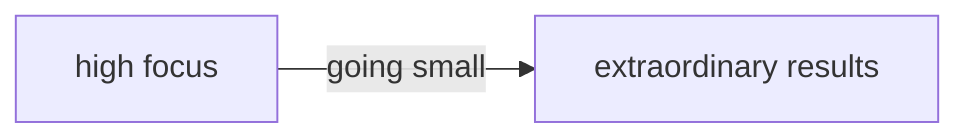

> you need to do more things to have more effect

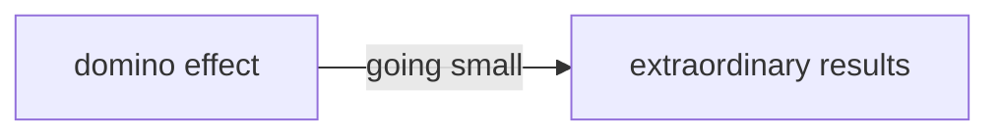

> The key is overtime, success is built sequentially, one thing at the time

### Establish A priority

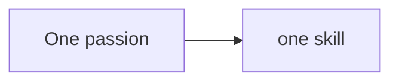

ex. 

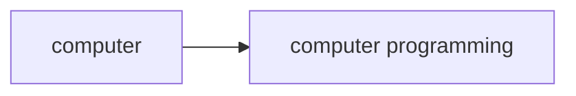

> There can only be one important thing.Many things can be important but only one can be the most important

### Lies

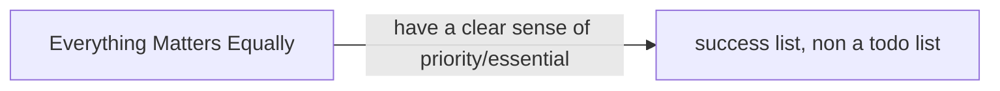

> Follow the Pareto-Law, even further -> 80/20/20 -> 25 things|5 thigns|1 things

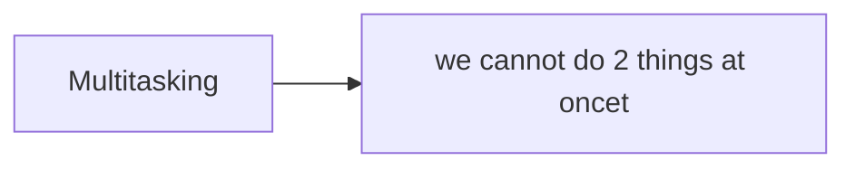

> The cost in terms of extra time from switch depends on how complex or simple the tasks are

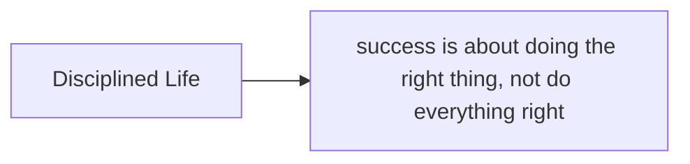

> Build one habit ( a powerful one) at the time (it takes time c.ca 66 days)

Willpower Is Always on Will-Call:

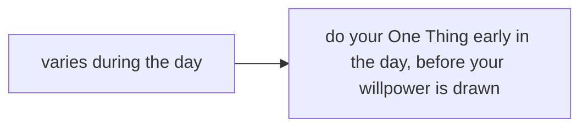

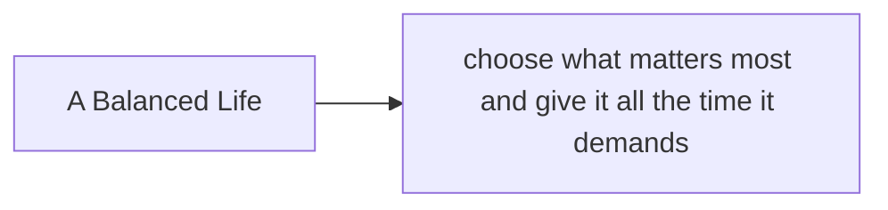

> the above require to get out of balance in relation to all other work issues
> In the personal world, this is achieve with ==awareness==

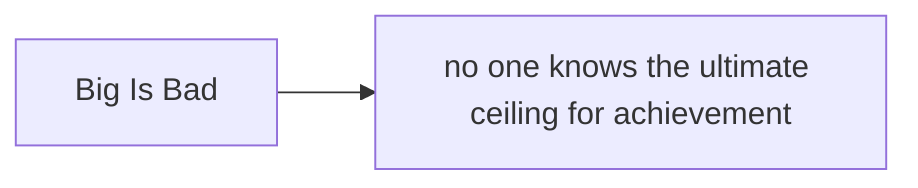

> Thinking big is essential to extraordinary results.
> Success require action and action require thought.
> ==To live great you have to think big, aim high, act bold.==
> Fear mediocrity, not big.

### Focusing questions

> ==What's the One Thing I can do such that by doing it everything else will be easier or unnecessary?==


Ly life's areas


### How to ask great questions

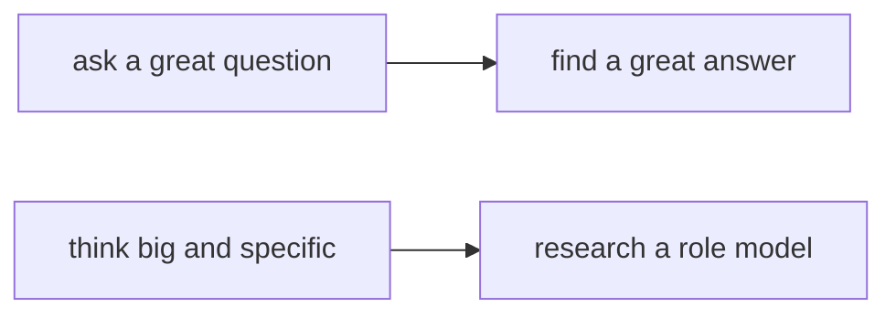

### Find great answers

Search within the reach of your knowledge, skills and experience.

The research and experience of others is the best palce to start when looking for answers


### Extraordinary results


### Live with purpose

> To be financially wealthy you must have a purpose for your life. In other words, without purpose, you'll never know when you have enough money, and you can never be financially wealthy.

> ==What's the One thing I can do in my life that would mean the most to me and the world, such that by doing it everything else  would be easier or unnecessary.==

**What is my purpose?**
<input placeholder="start to type and then replace this html tag" maxlength="50" size="50">

> Purpose without priority is powerless.


> People who can visualize the process, performed better.
> Start earlier and increase frequency.


> =="Productivity isn't about being a workhorse, keeping busy or burning the midnight oil.... It's more about priorities, planning, and fiercely protecting your time. "==
>  —Margarita Tartakovsky

### Time blocking

> Productive people get more done, achieve better results, and earn far more in their hours than the rest. They do so because they devote maximum time to being productive on their top priority, their ONE Thing.
> ==They time block their ONE Thing and then protect their time blocks with a vengeance.==

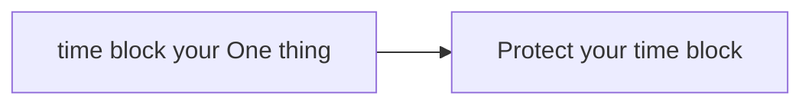

#### Wrong below


> If disproportionate results come from one activity, then you must give that one activity disproportionate time

#### Correct below


0. Block time as early in your day as you possibly can.
1. Time block your time off. 
2. Time block your ONE Thing. 
3. Time block your planning time.
4. Don't block more than 4 hours a day.

> Don't work on time, like it's 5 PM. Let's go home!
> Work based on event: "My work is done. Let's go home"

> Efficiency is doing things right.
> ==Effectiveness== is doing the right thing.
>
> ```
> - Peter Drucker
> ```

> ==To experience extraordinary results, be a maker in the morning and a manager in the afternoon. Your goal is "ONE and done." But if you don't time block each day to do your ONE Thing, your ONE Thing won't become a done thing.==

Mantra

> Until the One thing is done, everything else is a distraction!

Build a bunker. Find somewhere to work that takes you out of the path of disruption and interruption. If you have an office, get a "Do Not Disturb" sign. If it has glass walls, install shades.

#### The path of mastery

> ==The path of mastering something is the combination of not only can do at it, but also doing it the best it can be done. Continually improving how you do something is critical to getting the most from time blocking. 
> It's called moving from "E" to "P." 
> When we roll out of bed in the morning and start tackling the day, we do so in one of two ways: Entrepreneurial ("E") or Purposeful ("P").==


#### Accountability


#### The 4 thieves

THE FOUR THIEVES OF PRODUCTIVITY 

1. Inability to Say "No" (key to success is not try to please everybody)
2. Fear of Chaos
3. Poor Health Habits (more energy &lt;- good sleep, eat well, exercise)
4. Environment Doesn't Support Your Goals

### The journey

A life worth living might be measured in many ways, but the one way that stands above all others is living a life of ==no regrets.==

> The most common regret was this: I wish I'd had the courage to live a life true to myself not the life others expected of me. 

### Success

> ==Success is an inside job.==
> Put yourself together, and your world falls into place. VVhen you bring purpose to your life, know your priorities, and achieve high productivity on the priority that matters most every day, your life makes sense and the extraordinary becomes possible. All success in life starts within you. You know what to do. You know how to do it. Your next step is simple. 
> You are the first domino.

* * *

## Summary

- The :heart: of the book; **use your One Thing**

  Let the ONE Thing bring clarity to the key areas of your life. Here's a short sampling. 

?
?
?

