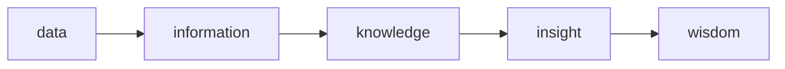

# Mental models

three tyoes if mental models here:

1. simplification of the world (synthesis)
2. mathematical analogies (models speak in math)
3. artificial constructs (structures within we can think logically)

## Why we need models?

- Better thinking.
- make reason of big amount of data.

## what wrong whit models?

They simplify...omits details.
To overcome this issue we can consider using #multi-models.
 \#Complex-systems are difficult to explain, evolve, predict.

 data -> information -> knowledge (info + structure)  -> wisdom (ability to apply relevant knowledge)

## 7 uses of models:

reason, predict, design, communicate, act, predict, and explore.

## First things first:

 \#first-things-first: if you have more than 1 task, do the most important first; Has mayor impact.
A.k.a. #big-rock-first. 
Under certain condition, obviously.
For ex. in **_big packaging problem_** and is know as #first-fit-algorithm

## #Simpson-paradox:

This seemingly unintuitive possibility is referred to as Simpson's paradox.

Let's go back to our example on problem accuracy competition to see how this can occur.
On Saturday, you solved 77 out of 88 attempted problems, but your friend solved 22 out of 2.2. You had solved more problems, but your friend pointed out that he was more accurate, since 7/8 < 2/2. Fair enough.
On Sunday, you only attempted 22 problems and got 11 correct. Your friend got 55 out of 88 problems correct. Your friend gloated once again, since 1/2 < 5/8.
However, the competition is about the one who solved more accurately over the weekend, not on individual days. Overall, you have solved 88 out of 1010 problems whereas your friend has solved 77 out of 1010 problems. Thus, despite your friend solving a higher proportion of problems on each day, you actually won the challenge by solving the higher proportion for the entire weekend! While your friend got furious, you calmly pointed him to this page: you had just shown an instance of Simpson's paradox.

Social phenomena are much less predictable thaN physical phenomena.

