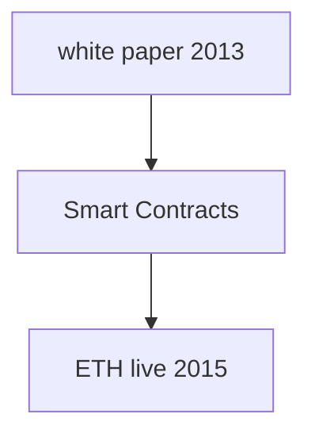
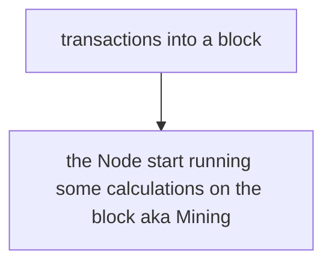

# Ethereum

*Smart Contracts: code that lve on the Ethereum Blochchain

* Ethereum networks are used to transfer money and store data 
* There are many different Ethereum networks. 
* Networks are formed by one or more nodes. 
* Each node is a machine running an ethereuC2n client. 
* Anyone can run a node. 
* Each node can contain a full copy of the blockchain 
* The 'blockchain' is a database that stores a recl)rd of every transaction that has ever taken place

How to work with ETHEREUM?

---

Rapsten, Kavan and Rinkeby are test networks (remote)
localhost 8545 is a local Node

---

What is a transaction?

The transaction is then sent a particular node.
Our and Other people transaction: basically those transactions are assembled into a block. 

---

What are Smart Contracts and how we build them?

---
Notice the difference from External and Contract Account

---

What is Solidity?

---
Solidity is not execute directly but...

---
Plus our extra JS code (plus html, css) will interact with ABI to understand the Bytecode:

