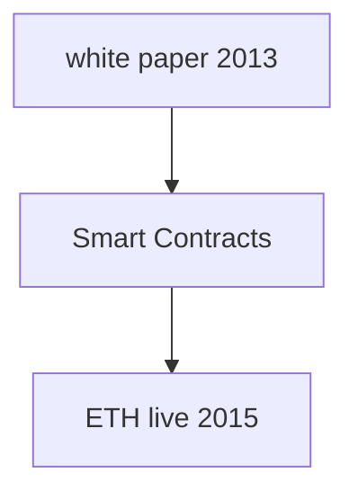

# Ethereum

*Smart Contracts: code that lve on the Ethereum Blochchain

* Ethereum networks are used to transfer money and store data 
* There are many different Ethereum networks. 
* Networks are formed by one or more nodes. 
* Each node is a machine running an ethereuC2n client. 
* Anyone can run a node. 
* Each node can contain a full copy of the blockchain 
* The 'blockchain' is a database that stores a recl)rd of every transaction that has ever taken place

- How to work with ETHEREUM?

---
Rapsten, Kavan and Rinkeby are test networks (remote)
localhost 8545 is a local Node

