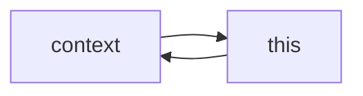

## Principles

<details><summary>
Returning vs mutating
</summary>
<br>
ex.
when I add one item to an array, such as: \<arrayName>.push()
I'm mutating the array, since it's modified

Some array methods are not #mutating, they're instead #returning,
such ad #Map() and #Filter()

```javascript
    let pets = [
        {name: "Meowsalot" ,species: "cat",age:3},
        {name: "Barksalot" ,species: "dog",age:4},
        {name: "Purrsloud" ,species: "cat",age:1}
        ]
    // Mapping over an array
    pets.map( (pet)=>{ return pet.name} )
    // result:
    // (3) ["Meowsalot", "Barksalot", "Purrsloud"]

    // Filter an array
    // old way
    let dogs = pets.filter( onlyDogs )
    function onlyDogs(pet){
        return pet.species == "dog"
    }
    // ES^ way
    let dogs = pets.filter( (onlyDogs)=>{return onlyDogs.species == "dog"} )
    console.log(dogs)
    // result:
    // [{…}]
    //     0: {name: "Barksalot", species: "dog"}
    //     length: 1
    //     __proto__: Array(0)

    // #method-chain
   let dogs = pets.filter( (onlyDogs)=>{return onlyDogs.species == "dog"} ).filter((onlyBabies)=>{return onlyBabies.age > 3}).map( pets => {return pets.name} )
    // result: ["Barksalot"]

```
</details>
<br>
<details><summary>
Scope
</summary>

#scope -> #variable
```javascript
    function sayMyName(){ 
    var myName ="Cris" // the variable is scope to this function, not accessible from the outside
    }
x()
console.log(sayMyName)
// VM254:5 Uncaught ReferenceError: myName is not defined
```

```javascript
    let myName = "Cris outside"
function callMyName(){
    let myName = "Cristian"
    if(true){
    let myName = "Cristianf"
    console.log("inside if statement", myName)
    }
    console.log("inside our function", myName)
}

callMyName()
console.log("In the global scope",myName)
// VM949:6 inside if statement Cristianf
// VM949:8 inside our function Cristian
// VM949:12 In the global scope Cris outside

```

Summary:
Every scope has his own variables.
#let uses #block-scope
#var uses #function-scope
</details>

<details><summary>
Context
</summary>

#context -> #object

 #this does not point to the enclosing #object, points the the object that is #executing the current function

 Basically, as good practice, keep function outside of object, using #this keyword and the the #method can #call() the object
 ```javascript
    let person = { name: 'Cris'}
    let car = { age: 3 }
    function sayName(){console.log(this.name)} 
    // sayName.call(<here use the object you want the 'this' points to>)
    sayName.call(person)
 ```

 #Exception: If I use #arrow-function I don't have the problem of 'this'; 
 they go up from inside -> out, so ()=>{} don't change the value of 'this' keyword.
</details>

<details><summary>
#Hoisting
</summary>
Order of code lines matters in JS counts.
#function in JS are hoisted (lifted up)
</details>

<details><summary>
Template literals
</summary>

```javascript
    const myName = 'Cristian'
console.log(`My name's ${myName}`)
    // My name's Cristian
```
</details>

<details><summary>
#Semicolon
</summary>

Semicolons are useful to keep separate code on the same line.
It's basically a period at the end of a sentence.
 If I go do a break line, I don't need it, because JS do it automatically.
 Use it or no if I break a line, is a matter of style / preference.
 ```javascript {.line-numbers highlight=[2,6]}
 // This will work
    const myName = 'Cristian'; console.log(`My name's ${myName}`)
     // My name's Cristian

     // This will not work:
     const myName = 'Cristian' console.log(`My name's ${myName}`)
 ```
</details>


 #nullish-coalescing-operator (??) 
 #Optional-chaining-operator (?.)
