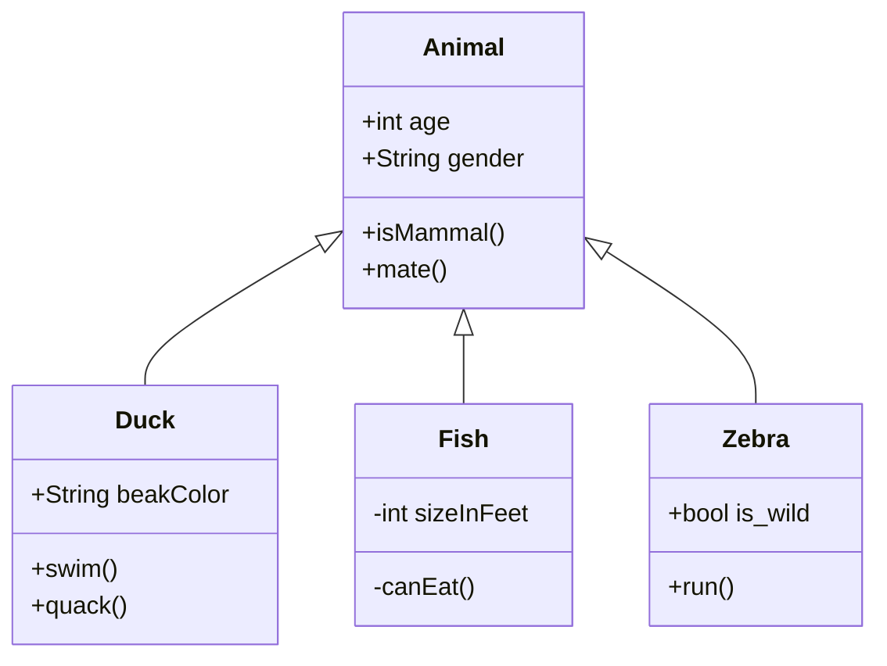
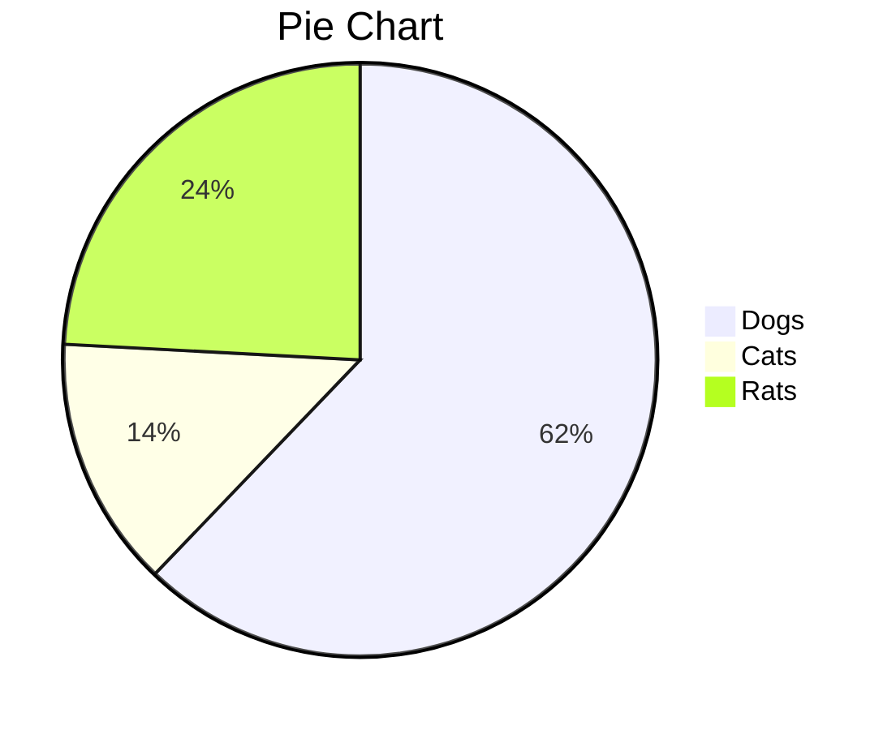
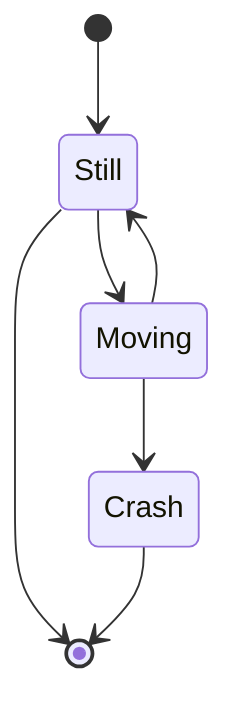
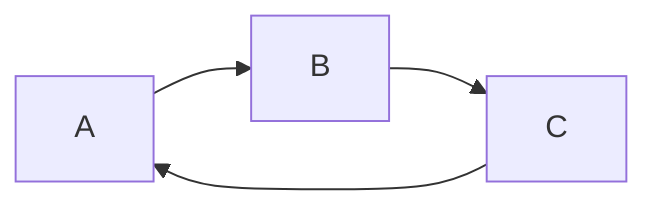

### [Emoji reference](https://github.com/ikatyang/emoji-cheat-sheet)
### [from html tables to md](https://jmalarcon.github.io/markdowntables/)


## [reference](https://www.dendron.so/notes/ba97866b-889f-4ac6-86e7-bb2d97f6e376.html)
# Examples:

---

---

---

---

```sequence {theme="hand"}
Andrew->China: Says Hello
Note right of China: China thinks\nabout it
China-->Andrew: How are you?
Andrew->>China: I am good thanks!
```
---

$f(X) = sin(x) + 12$

---
```flow
st=>start:http://www.example.com
```
---


---

```ditaa {cmd=true args=["-E"]}
  +--------+   +-------+    +-------+
  |        | --+ ditaa +--> |       |
  |  Text  |   +-------+    |diagram|
  |Document|   |!magic!|    |       |
  |     {d}|   |       |    |       |
  +---+----+   +-------+    +-------+
      :                         ^
      |       Lots of work      |
      +-------------------------+
  ```

---

`
---

