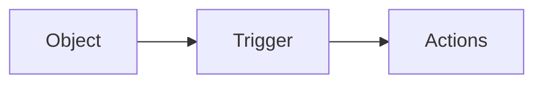

# Platform App Builder
<details><summary>
Study reference:
</summary>

[[Salesforce exam|computer-science.platform.salesforce.exams]]
sources:
[Trailmix](https://trailhead.salesforce.com/users/strailhead/trailmixes/prepare-for-your-salesforce-platform-app-builder-credential)
[Trailhead exam prep](https://trailhead.salesforce.com/en/content/learn/trails/platform-app-builder-certification-prep)
[Salesforceben](https://www.salesforceben.com/platform-app-builder-certification-guide-tips/)
</details>

---

# Modules:

## **Salesforce Fundamentals** 8%

### [Lightning Experience Customization](https://trailhead.salesforce.com/content/learn/modules/lex_customization?trailmix_creator_id=strailhead&trailmix_slug=prepare-for-your-salesforce-platform-app-builder-credential)

<details><summary>
What is a Lightning App?
</summary>
 is a collection of items that work together to serve a particular function. In Lightning Experience, Lightning apps give your users access to sets of objects, tabs, and other items all in one convenient bundle in the navigation bar.
</details>
<details><summary>
What Do Compact Layouts Do?
</summary>
Compact layouts control which fields your users see in the highlights panel at the top of a record.
</details>
<details><summary>How to make a Lightning App?
</summary>
go to Setup -> #App-Manager
No #Lightning-App-Builder since this one is used to Custom Lightning pages fo Lightning X and mobile App.
</details>

<details><summary>
What are Compact Layouts?
</summary>

- Compact layouts control which fields your users see in the highlights panel at the top of a record.

- They also control the fields that appear in the expanded lookup card you see when you hover over a link in record details, and in the details section when you expand an activity in the activity timeline.

Is available from:
 Setup -> Object Manager
</details>

<details><summary>
Can I customize the Fields in Record Details?
</summary>
Yes, Setup -> Object Manager -> Page Layout and use the drag & drop functionality
</details>

<details><summary>
What are Quick Actions and how to set them up?
</summary>
We have 2 types:

 - Object-specific actions
 - Global actions

Create a Object-specific actions:
1. Setup -> Buttons, Links, and Actions
2. add it to the Page-Layouts:
 -> select the Page Layout you want the action be added 
 -> drag & drop the action where you want to see it

Create a Global Action:
 It lets users create a **_object-record_** no matter where they are in Salesforce. A global action is an ideal way to do this, because the global actions menu appears at the top of every page.
1. setup -> #Global-Actions ...
2. add the action:
    - go to: #Publisher-Layouts -> edit -> drag & drop
</details>

---

### [Service Cloud for Lightning Experience](https://trailhead.salesforce.com/content/learn/modules/service_lex?trailmix_creator_id=strailhead&trailmix_slug=prepare-for-your-salesforce-platform-app-builder-credential)

<details><summary>
What is the #Service-Cloud?
</summary>
- #Service-Cloud is an easy-to-use customer service application that can help you provide and track excellent service.
- You can reach it from the #Service-Console
</details>
<details><summary>
How do you setup the #Service-Cloud?
</summary>
1. Automate #case-management
2. Add multiple channels
3. Capture knowledge
4. Expand efficiencies with AI
</details>

<details><summary>
Which #Case-management-tools do you know?
</summary>

|||
|---|---|
|Queues | Automatically prioritize your support team’s workload by creating lists from which specific agents can jump in to solve certain types of cases.|
|Assignment Rules | Automatically assign incoming cases to specific agents so that the right people work on the right cases.|
|Escalation Rules | Automatically escalate cases to the right people when the cases aren’t solved by a certain time.|
|Auto-Response Rules | Automatically send personalized email responses to customers based on each case’s details.|
</details>


<details><summary>
Which Case tools should I use?
</summary>

|Question|Answer|Tool|
|--- |--- |--- |
|Do support agents work as a team on specific issues?|Yes, some agents work off a list of emails as they arrive from customers.|Queues|
|How is the support team structured?|We have Gold and Platinum support teams. Platinum support shares a workload.|Queues or assignment Rules|
|Do support agents work on specific products or have special skill sets?|Some agents work on solar panel installation while others work on solar panel performance.|Assignment Rules|
|Do cases need to escalate to someone if they’re not solved by a specific time?|Yes, we can’t have customers waiting more than 5 hours to get their issues solved.|Escalation Rules|
|Should customers receive automatic responses?|Yes, we want customers to know that we received their issue and that we care about them.|Auto-response Rules|
</details>


<details><summary>
Which #Digital-engagement-tools do you know?
</summary>

1. email service
2. web form service
[Learn to set them up in this trail](https://trailhead.salesforce.com/content/learn/modules/service_lex/service_lex_channels?trailmix_creator_id=strailhead&trailmix_slug=prepare-for-your-salesforce-platform-app-builder-credential)
</details>

---

## **Data Modeling and Management** 20%

### [Leads & Opportunities for Lightning Experience](https://trailhead.salesforce.com/content/learn/modules/leads_opportunities_lightning_experience?trailmix_creator_id=strailhead&trailmix_slug=prepare-for-your-salesforce-platform-app-builder-credential)

<details><summary>
How do you #convert-lead?
</summary>


</details>

<details><summary>
mandatory fields on Lead?
</summary>
Name, LastName, Company, Lead Status
</details>

<details><summary>
mandatory fields on Opportunity?
</summary>
Name, Closed Date, Stage
</details>

<details><summary>
What is Contact Roles on Opportunity?
</summary>
Contact roles on opportunities tell you which contacts you’re dealing with and how each contact is related to the opportunity
</details>

<details><summary>
What is an #Opportunity-team?
</summary>

It helps team members work together and track the opportunity’s progress.
1. enable from: Setup -> Feature Settings -> Sales -> Opportunities -> Opportunity Team Settings
2. check if #Opportunity-team on the right side of opportunity exist
3. if yes, click the arrow down and choice what to do next
4. In #Edit-opportunity-splits add splits values
</details>

<details><summary>
How you can visualize success?
</summary>
Uasing #path and #kanban
</details>

<details><summary>
mandatory fields on Account?
</summary>
Name
</details>

<details><summary>
mandatory fields on Contact?
</summary>
LastName
</details>

---

### [Data Modeling](https://trailhead.salesforce.com/content/learn/modules/data_modeling?trailmix_creator_id=strailhead&trailmix_slug=prepare-for-your-salesforce-platform-app-builder-credential)

<details><summary>
What's a #Data-model?
</summary>
It's a representation of data in a way that make sense at humans.
 #[design-data-model](https://help.salesforce.com/articleView?id=schema_builder.htm&type=5)
</details>
<br>
<details><summary>
What is a #SF-object and the difference between #Standard-object and #Custom-object?
</summary>
It's like a table in the database, where columns are #fields and rows are #records.
- #Standard-object(s) are objects that are included with Salesforce. Common business objects like Account, Contact, Lead, and Opportunity are all standard objects.
- #Custom-object(s) are objects that you create to store information that’s specific to your company or industry. 
</details>
<br>
<details><summary>
What are #object-relationships and what types of relationship do you know?
</summary>
They're a #special-field-type that connect two objects together.
#Lookup-relationship let you 'look up' an object from another.
There's 2 types: #one-to-one and #one-to-many.

#Master-detail-relationship are 'tighter' relationship.
The master object controls certain behaviors of the detail object, like who can view the detail’s data.
The detail object highly dependent on the master. In fact, if a record on the master object is deleted, all its related detail records are deleted as well. 
In a #Master-detail-relationship the Master is always a #Standard-object and the detail is the #Custom-object.
The field is added always on the master side of the #Master-detail-relationship
Trailblazer Community docs on relationships: [link](https://help.salesforce.com/articleView?id=relationships_considerations.htm&type=5)
</details>

<details><summary>
What is and what you can do with the #Schema-builder?
</summary>
It's a tool that let you manage the #Data-model from the #Setup menu.
You can create Objects, fields, add relationship and all is visual and drag & drop
</details>

---

### [Data management](https://trailhead.salesforce.com/content/learn/modules/lex_implementation_data_management?trailmix_creator_id=strailhead&trailmix_slug=prepare-for-your-salesforce-platform-app-builder-credential)

<details><summary>
How do you #Import-data?
</summary>
I can import #CSV files with those tools:
#Import-wizard
#Data-Loader
#Dataloader.io

|If you want to . . .|Import Wizards |Data Loader/Dataloader.io|
|--|--|--|
|Import fewer than 50,000 records.|:white_check_mark:| :white_check_mark:
|Prevent duplicates when importing new records. |:white_check_mark:|
|Choose whether or not to trigger workflow rules and processes. |:white_check_mark:|
|Load up to 5,000,000 records (Dataloader.io limit is 100MB/file or about 500,000 to 1,000,000 records). ||:white_check_mark:
|Load objects such as products or opportunities. ||:white_check_mark:
|Schedule imports. ||:white_check_mark:
|Save mappings for later use. ||:white_check_mark:
|Export or delete data. ||:white_check_mark:

More info [link](https://trailhead.salesforce.com/content/learn/modules/lex_implementation_data_management/lex_implementation_data_import?trailmix_creator_id=strailhead&trailmix_slug=prepare-for-your-salesforce-platform-app-builder-credential) here
[Video-series on import](http://pages.mail.salesforce.com/gettingstarted/sales-cloud/import-export-data/)
</details>

<details><summary>
How do I #Export-data, even for #backup data?
</summary>
In a #CSV format with those official tools:
#Data-Loader
#Data-export-service, accessible from #Setup menu -> #Data-export. It can even scheduled.
It allows you to export data manually once every 7 days (for weekly export) or 29 days (for monthly export)
</details>

<details><summary>
Can I transfer Data? And with which tools?
</summary>
From #Setup menu I can use #Mass-transfer-records to move data.
</details>

<details><summary>
Can I delete more records at once?
</summary>
I can mass delete records using the #Mass-delete-records.
</details>

----

### [Picklist amministration](https://trailhead.salesforce.com/content/learn/modules/picklist_admin?trailmix_creator_id=strailhead&trailmix_slug=prepare-for-your-salesforce-platform-app-builder-credential)

<details><summary>
What are #Picklist(s)?
</summary>

Picklists are menus that expand to give users choices.
Is composet of:
- field
- value set
We have three type of picklists:
1. **Standard**: the ones that are included in your Salesforce org before any customization.
2. **Custom**: the one you create to have custom picklist's behaviour
3. **Custom Multi-Select**: if you want the user be abke to select more than one value
and fields can have those properties:
* #**Restricted-picklists** : doesn't let you add new values, even with APIs, the idea is to create consistency
* **#Dependent** or **#Controlling**: it's based on a selection from another picklist or a checkbox (the controlling value) on the same record

 &nbsp;  | Standard Picklist | Custom Picklist | Custom Multi-Select Picklist
---|------------------|-----------------|-----------------------------
Add/Remove from Page Layouts | :white_check_mark: | :white_check_mark: | :white_check_mark:| :white_check_mark:
Delete from Your Org |  | :white_check_mark: | :white_check_mark:| :white_check_mark:
Set a Default Value | :white_check_mark: | :white_check_mark: | :white_check_mark:| :white_check_mark:
Use a Formula for a Default Value |  | :white_check_mark: | :white_check_mark:| :white_check_mark:
Can Select Multiple Values |  |  | :white_check_mark:| :white_check_mark:
Can Add Values via Apps or API | :white_check_mark: | :white_check_mark: | :white_check_mark:| :white_check_mark:
Can Be Restricted |  | :white_check_mark: | :white_check_mark:| :white_check_mark:
Can Be a Dependent Picklist |  | :white_check_mark: | :white_check_mark:| :white_check_mark:
</details>
<br>
<details><summary>
How can I edit picklist values?
</summary>
from #Setup menu -> #Object-manager -> Object -> Fields & relationship -> choose Picklist value -> Edit...
ex. here from trailhead: [link](https://trailhead.salesforce.com/content/learn/modules/picklist_admin/picklist_admin_manage?trailmix_creator_id=strailhead&trailmix_slug=prepare-for-your-salesforce-platform-app-builder-credential)
</details>

<details><summary>
What are #Global-set-values and what they let you to do?
</summary>

#Global-set-value(s) are always #restricted and let you share the same picklist values with more than one picklist field.
**If not restricted, you will not be able to promote it.**
Two ways to use it:
1. from #Seutp menu -> #Picklist-value-sets -> new...
then, on a Object -> Fields & relationship -> New -> Picklist -> Next -> now select The #Global-set-value that you want to use.
#Use-global-picklist-value-set
2. from #Seutp menu -> Object -> Fields & relationship -> choose a picklist -> Edit -> #Promote-to-global-value-set
</details>

---

### [Duplicate Management](https://trailhead.salesforce.com/content/learn/modules/sales_admin_duplicate_management?trailmix_creator_id=strailhead&trailmix_slug=prepare-for-your-salesforce-platform-app-builder-credential)

<details><summary>
What can I do to avoid duplicate data?
</summary>
Identify if there're duplicate records, using the Duplicate Management; it helps you and your sales teams quickly and easily manage duplicates for:
Business accounts
Contacts
Leads
Person accounts
Records created from custom objects
Accessible from #setup menu:
#Matching-rules
#Duplicate-rules

|What It Is|What It Defines|
|--- |--- |
|Matching rule|The matching criteria to identify duplicate records.Salesforce comes with three standard matching rules: one for business accounts; one for contacts and leads, and another for person accounts. Creating other matching rules is a cinch. We show you how Maria does it in the next unit.|
|Duplicate rule|When Salesforce engages matching rules and determines actions to take as it encounters duplicates.Depending on how you configure Duplicate Management, sales reps see an alert that they’re about to create a duplicate. Or your reps are blocked from creating the duplicate altogether. If your company started using Salesforce in Spring ’15 or later, we give you standard duplicate rules for business accounts, contacts, leads, and person accounts. If your company started using Salesforce in Winter ’15 or earlier, like Maria, you create the rules on your own, which is easy.|

You can create a #Report in order to check for duplicate records.
#Setup -> #Report-types -> ... -> select as #Primary-object the #Duplicate-record-items/#Duplicate-record-sets

</details>

---

## **Security** 10%

### [Data Security](https://trailhead.salesforce.com/content/learn/modules/data_security?trailmix_creator_id=strailhead&trailmix_slug=prepare-for-your-salesforce-platform-app-builder-credential)

<details><summary>
Which are the levels of Data Access? 
</summary>

1. Organization -> auth users, password policies, location and hours login limits, trusted IP ranges (using #Profile)
2. Objects: setting permission on an object, from #Profile or #Permission-sets
3. Fields: restrict level access
4. Records: record access determines which individual records users can view and edit in each object they have access to in their profile. First ask yourself these questions:
- Should your users have open access to every record, or just a subset?
- If it’s a subset, what rules should determine whether the user can access them?

You control record-level access in four ways.
    - #Organization-wide-defaults
    - #role-hierarchy
    - #sharing-rules: found at #setup->#Security->#Sharing-Settings.
        You need to define a #Public-group
        - #Private
        - #Public-Read-Only
        - #Public-Read-write
        - #Controlled-by-Parent
    - #manual-sharing


Changes in Security can be tracked in the Audit section:
#setup -> #Security -> #View-Setup-Audit-Trail
Different view for profile from Dev Org and normal one.

</details>

### [Identity Basics](https://trailhead.salesforce.com/content/learn/modules/identity_basics?trailmix_creator_id=strailhead&trailmix_slug=prepare-for-your-salesforce-platform-app-builder-credential)
<details><summary>
Which are three main features of Salesforce Identity?
</summary>

* Single sign-on (#SSO)
* Connected apps
* Social sign-on
* Two-factor authentication (#2FA)
* My Domain
* Centralized user account management
* User provisioning
* Identity Connect
* App Launcher

And they're already avaible on your Org.

</details>

<details><summary>
Which are the language of Identity?
</summary>
#Language-of-Identity

1. #SAML: is the protocol that allow #SSO (When you want users to move seamlessly between Salesforce orgs and applications without logging in repeatedly). It's an #XML-based protocol
2. #OAuth 2.0 , allow secure data sharing between applications
3. OpenID Connect, #OpenID-Connect is protocol that adds an authentication layer on top of OAuth 2.0 to enable secure exchange of user information.

One Term | That’s Easily Confused with This Term
---------|--------------------------------------
Authentication means who a person is. These days, authentication is often used as shorthand for authorization and authentication. | Authorization means what a person can do.
Protocol specifies the set of rules that enable systems to exchange information. Generally, the term protocol and standard are used interchangeably. | Standard is a specification, a set of industry practices that vendors agree to support. Often, a standard contains a protocol to specify how the companies implement the standard.
Username and password are what the user supplies to log in to a system. | Credentials are basically the same thing.
Single sign-on (SSO) enables a person to log in once and access other apps and services without logging in again. | Social sign-on enables a person to log in to an app using the credentials established with a social account like Google. That app accepts the Google credentials, and the user doesn’t have to create another account and password.
Identity provider is a trusted service that enables users to access other websites and services without logging in again. | Service provider is a website or service that hosts apps and accepts identity from an identity provider.
</details>

---

### Security Specialist Superbadge

<details><summary>
Security Superbadge?
</summary>

1. 
Set object-level security settings:
    - create 3 profiles
    - Sales executive User: set to only read access to Account and Opportunity object and View All
    - Field sales: not delete on Opp and cannot Delete and Create Account
    - Inside User: cannot Delete account and Opp

2. 
Set record-level security settings:
    - create a new USer and set her as a Field Sales User
    - create role Field User and assign it to Samantha
    - create 2 opps
    - create a sSharing Rule that shares Opportunities owned by Field Sales users with Inside Sales users.
        - create a Public Group
    - make opp private -> restrict access to Private
    - sharing rules: for Project manager and 
3. Qestions on Set appropriate password policies
4. Track field-level changes
 set track field level on Account, Contact, Opportunity from Fields and Relationship -> Set History fields any fields I want since doens't say
5. Set report, dashboard, and public list view security settings:
for each user (3) in object permission set as requested...
6. Set up two-factor authentication:
I foun this trail to guide me in the setting of 2FA even if confusing since @FA has become MFA (multi factor auth.)
7. Track changes to Salesforce settings (quiz)
Setup-audit-trail let you track all changes in Settings
How many days worth of changes to settings can you download?
-> from Audit trail you can read that download is up to 6 months
How many settings changes can you view directly within Setup (without downloading history)?
20 as at the top of Audit trail page...
If a delegate (like an admin or customer support representative) makes a setup change on behalf of an end user, what data is logged within Setup Audit Trail?
-> both end user and delegate
</details>

---

## **Business Logic and Process Automation** 27%

https://trailhead.salesforce.com/users/strailhead/trailmixes/prepare-for-your-salesforce-platform-app-builder-credential

### [Formula & Validations](https://trailhead.salesforce.com/content/learn/modules/point_click_business_logic?trailmix_creator_id=strailhead&trailmix_slug=prepare-for-your-salesforce-platform-app-builder-credential)

[Formula & Validations Cheatsheet](assets/pdfs/SF_Formulas_Developer_cheatsheet_web.pdf)

<details><summary>
Why #formula-fields?
</summary>

example: what if you wanted to calculate how many days are left until an opportunity’s close date.
Object Manager -> Oppurtunity -> fields & relationship -> new -> formula -> next -> Field label add 'Days to Close' -> select Number -> next ... -> in the formula area type or choose fields available: 
```java
ClodeDate - TODAY()
```
</details>

<details><summary>
What's the #Power-of-one?
</summary>
It's used to count the number of #unique-objects in a report with hundreds of records.
</details>

<details><summary>
What are #roll-up summary fields?
</summary>

A Roll-Up Summary Fields display a value on a master record based on the values of records in a detail record.
[Roll-up reference](https://trailhead.salesforce.com/content/learn/modules/point_click_business_logic/roll_up_summary_fields?trailmix_creator_id=strailhead&trailmix_slug=prepare-for-your-salesforce-platform-app-builder-credential)
Type | Description
-----|------------
COUNT | Totals the number of related records.
SUM | Totals the values in the field you select in the Field to Aggregate option. Only number, currency, and percent fields are available.
MIN | Displays the lowest value of the field you select in the Field to Aggregate option for all directly related records. Only number, currency, percent, date, and date/time fields are available.
MAX | Displays the highest value of the field you select in the Field to Aggregate option for all directly related records. Only number, currency, percent, date, and date/time fields are available.
</details>

<details><summary>
What are validation rules?
</summary>

Validation rules verify that data entered by users in records meet the standards you specify before they can save it.
It evaulate an expression that return a 'true' or 'false' value.
[Val. rules reference](https://trailhead.salesforce.com/content/learn/modules/point_click_business_logic/validation_rules?trailmix_creator_id=strailhead&trailmix_slug=prepare-for-your-salesforce-platform-app-builder-credential)
</details>

----


## [Lightning Flow](https://trailhead.salesforce.com/content/learn/modules/business_process_automation?trailmix_creator_id=strailhead&trailmix_slug=prepare-for-your-salesforce-platform-app-builder-credential)
<details><summary>
What is Lightining Flow?
</summary>

It's a declarative process automation.
It includes: 
- Process Builder
- Flow Builder
</details>

<details><summary>
Which Automation Tool Is Right for My Use Case?
</summary>

Type of Business Process | Description | Available Tools
-------------------------|-------------|----------------
Guided visual experience | Business processes that need input from users, whether they’re employees or customers. | Flow Builder
Behind-the-scenes automation | Business processes that get all the necessary data from your Salesforce org or a connected system. In other words, user input isn’t needed. | Process Builder, Flow Builder, Apex
Approval automation | Business processes that determine how a record, like a time-off request, gets approved by the right stakeholders. | Approvals

[Which automation tools trailhead guide](https://trailhead.salesforce.com/content/learn/modules/business_process_automation/process_whichtool?trailmix_creator_id=strailhead&trailmix_slug=prepare-for-your-salesforce-platform-app-builder-credential)


</details>

<details><summary>
Process builder?
</summary>

Accessible from Setup -> Precess Automation
 #process-builder

</details>

<details><summary>
Flow builder?
</summary>

Accessible from Setup -> Precess Automation
#flow-builder
</details>

<details><summary>
What are Approval Process?
</summary>

An #Approval-process automates how Salesforce records are approved in your org.
[quick trailhead reference for approval process](https://trailhead.salesforce.com/content/learn/modules/business_process_automation/approvals?trailmix_creator_id=strailhead&trailmix_slug=prepare-for-your-salesforce-platform-app-builder-credential)
[Approval process docs](https://help.salesforce.com/articleView?id=approvals_checklist.htm&type=5)

</details>


---

## [Screen Flow Distribution](https://trailhead.salesforce.com/content/learn/modules/screen_flow_distribution?trailmix_creator_id=strailhead&trailmix_slug=prepare-for-your-salesforce-platform-app-builder-credential)

<details><summary>
When Flow need an #Flow-action on a record instead of as default?
</summary>

Use Case | Example
---------|--------
The first element in the flow isn't a screen.The power of a flow is that it can do a lot of things behind the scenes, with the user none the wiser. But that can also make the flow a little bit dangerous, especially if it does those powerful, behind-the-scenes things before the first screen.| You built a flow that creates a task before displaying a screen to the user. If you put that flow on, say, the Account page, that flow would create a task every time a user loaded an account. That could result in lots of unnecessary tasks being created each day.
The flow isn't used often enough to be expanded by default. | You created a flow for your office managers to order new supplies. The office managers need to be able to access that flow easily, but they don't need to order supplies every day, so it would be a waste of space to put the flow directly on a record page.
</details>

<details><summary>
Where Flow can be added if needed on more records?
</summary>

If flow needs to be added from more than 1 record, you can add it to the #utility-bar,
It's only on all pages of 1 App.
</details>

<details><summary>
Can I add the Flow outside of Salesforce Org?
</summary>

1. Yes, You can add it to the a Salesforce Lightning #Community on:
    * Surveys
    * Registration forms
    * Interest forms
    * Quote generators, such as for a car they're selling
2. You can add it to a external app using #Lightning-out, but first enable Communities in Setup.
more info [here on this trailhead](https://trailhead.salesforce.com/content/learn/modules/screen_flow_distribution/screen_flow_distribution_external?trailmix_creator_id=strailhead&trailmix_slug=prepare-for-your-salesforce-platform-app-builder-credential)
</details>

---

## [Lightning Experience Productivity](https://trailhead.salesforce.com/content/learn/modules/lightning-experience-productivity?trailmix_creator_id=strailhead&trailmix_slug=prepare-for-your-salesforce-platform-app-builder-credential)

<details><summary>
Tell me about some productivity tools?
</summary>

- shortcuts: [#shortcuts](https://trailhead.salesforce.com/content/learn/modules/lightning-experience-productivity/elevate-your-daily-productivity?trailmix_creator_id=strailhead&trailmix_slug=prepare-for-your-salesforce-platform-app-builder-credential)
- #Notes and #files objects: you can add them to #related-lists from object manager -> Page Layouts -> ObjectName Layout -> select related Lists -> drag & drop the Notes/Files section in the Related Lists; [reference docs](https://help.salesforce.com/articleView?id=admin_files_related_list_setup.htm&type=5)
- #Global-search and refine results with filters
- collaborate with #feeds and #groups 
-#reports and #dashboards, you can even share them in Chatter to ask for some questions you may have about them but first enable #feed-tracking in Setup. Now the icon for collaboration will be available on your reports and dashboards so you can use the collaborate feature and even mention your colleague: [trailhead reference here](https://trailhead.salesforce.com/content/learn/modules/lightning-experience-productivity/analyze-your-data-with-reports-and-dashboards?trailmix_creator_id=strailhead&trailmix_slug=prepare-for-your-salesforce-platform-app-builder-credential)
</details>

<details><summary>
How can you migrate from Workflow rules to processes?
</summary>

[from Workflow rules to Processes trailhead](https://trailhead.salesforce.com/content/learn/modules/workflow_migration?trailmix_creator_id=strailhead&trailmix_slug=prepare-for-your-salesforce-platform-app-builder-credential)
1. map your criteria, map your actions, determines the order of your criteria
- Is a best practice use one automation tool for objects? yes, so I can predict for that object which are tre possible behavior without getting crazy looking between many tools automated or not
</details>

<details><summary>
When a #workflow-rule is evaluated?
</summary>

* created
* created or edited
* created or edited to subsequently meet criteria
</details>

<details><summary>
In which order #workflow-rule run?
</summary>

Workflow rules are always nondeterministic. In regular-person language: Salesforce can’t guarantee which workflow rule is evaluated first or second or seventh.
</details>

---

[#Process-Automation-Cheatsheet](/assets/pdfs/SF_Process_Automation_cheatsheet_web.pdf)

[Which automation tools should I used Complete guide docs](https://help.salesforce.com/articleView?id=process_which_tool.htm&type=5)

---

## **Social** 3%

### [Chatter Administration for Lightning Experience](https://trailhead.salesforce.com/content/learn/modules/lex_implementation_chatter?trailmix_creator_id=strailhead&trailmix_slug=prepare-for-your-salesforce-platform-app-builder-credential)

<details><summary>
What is #Chatter?
</summary>
It's a Salesforce collaboration tool that help users to work efficiently across all the organization regardless of role or location.
</details>

<details><summary>
What #Chatter-groups? 
</summary>

Groups are the main collaboration space in Chatter.
It's an Object and it's visible in the Tab section on dropdown for Tabs. 
Types:
* public
* Private
* Unlisted
* Broadcast-only
</details>

<details><summary>
What is #Field-tracking?
</summary>
Feed tracking makes it easy to see changes to critical records anytime, anywhere. You can select up to 20 fields to track.
</details>

<details><summary>
Can you use Chatter to #approval-process?
</summary>

Yes, An approval process maps the route that a record takes through the people who are aligned to provide approval. The approval process can send an approval request as a Chatter post. You can create a template for that post to ensure that the same type of data is posted with every request.
Steps:
1. Enable approval requests in Chatter.
2. Create an approval post template.
3. Create an approval process.
4. Enable feed tracking.
</details>

<details><summary>
What is a #rollout-strategy for Chatter?
</summary>
It allow to prepare for the Chatter relaease and can count on #Champions (#Sponsors, #Evangelists and #Community-Managers)
The rollout can be #profile-based. A profile-based Chatter deployment can be useful to larger organizations because it allows for a controlled, department-by-department deployment
</details>

---

### [Process Automation Specialist](https://trailhead.salesforce.com/content/learn/superbadges/superbadge_process_automation?trailmix_creator_id=strailhead&trailmix_slug=prepare-for-your-salesforce-platform-app-builder-credential)

<details><summary>
Notes from Superbadge
</summary>

1. to do (*)
- [x] validation rules:
    - only US leads
    - state field = valid US abbrev. ex. CA
    -  country field = US, USA,United States or blank
    <details><summary>
    formula
    </summary>
    formula:
    OR(AND(LEN(State) > 2, NOT(CONTAINS("AL:AK:AZ:AR:CA:CO:CT:DE:DC:FL:GA:HI:ID:IL:IN:IA:KS:KY:LA:ME:MD:MA:MI:MN:MS:MO:MT:NE:NV:NH:NJ:NM:NY:NC:ND:OH:OK:OR:PA:RI:SC:SD:TN:TX:UT:VT:VA:WA:WV:WI:WY", State )) ),NOT(OR(Country="US",Country ="USA",Country ="United States",ISBLANK(Country) )) )
    </details>

- [x] Queues -> two queues for leads: 
    - Rainbow Sales (web leads)
    - Assembly System Sales (partner and purchased list leads)
- [x] Marketing -> Lead Assignment Rules -> create a lead assignment rule, assign the 2 criteria to the 2 Queues just created in previous step

2. Automate Accounts: (***)
- Create validation rules and account formula fields (some are Roll-up Summary fields) as specified in the business requirements
<details><summary>
formulas
</summary>

- IF ( Number_of_deals__c>0, (Number_of_won_deals__c / Number_of_deals__c), 0)

</details>

3. Create Robot Setup Object for WON deal only: (*)
- create new custom object:  Robot Setup -> Master-detail rel on Opp.
- Autonumber the record name, starting with 0: and format: ROBOT SETUP-{0000}
    - Field Name -> the Master-detail on Opp
    - Date, Date__c -> Date type
    - Notes, Notes__c -> Text (long) type
    - Day of the Week, Day_of_the_Week__c -> formula field-> text

4. Automate Opportunities:
    - add a stage: 'Awaiting for Approval'
    - create checkbox field on OPP
    - setup-> Sales Processes: create a sale process and just use this value as video:
        - picklist values:
            Prospecting
            Qualification
            Proposal/Price Quote
            Negotiation/Review
            ==Awaiting Approval== to add
            Closed Won
            CLosed Lost
    - create a Record type from setup -> Obj Manager -> Opp -> Record Types:
    label: RB Robotics Process RT
    1. add a validation rules:
    / AND (ISCHANGED (Approved__c ), OR($Profile.Name <> 'System Administrator',$Profile.Name <> 'Custom: Sales Profile')) /
        - only Admin and Custom Sale Profile (Sale Manager) can check
    2. new validation rules: if opp > 100.000:
        AND(ISCLOSED = TRUE, Amount > 100.000 , Approved__c <> TRUE)

5. Automation:
    - create an Approval Process: Prospecting
    - Email Alerts -> on Finance: Account creation
    - Process Builder: 
- send email to Finance Group { Customer and Prospect Accts-> Opp Won}
- Create task for account owner
    - Subject: Send Marketing Materials
    - Due Date: 7 days from today
    - Priority: High
- 

6. Flow:
create a flow to show on the Opportunity Lightning page with a checkbox with this 3 values: RainbowBot, CloudyBot, or Assembly System

7. Automate setup:
any robot setup date that would fall on Saturday or Sunday is set to the following Monday instead using:
 - a Process that start when: 'a record changes'
</details>

---

## **User Interface** 14 %

## [Lightning App Builder](https://trailhead.salesforce.com/content/learn/modules/lightning_app_builder?trailmix_creator_id=strailhead&trailmix_slug=prepare-for-your-salesforce-platform-app-builder-credential)

<details><summary>
What is a Lightning Page?
</summary>

A Lightning page is a custom layout that lets you design pages for use in the Salesforce mobile app or Lightning Experience. A Lightning page is composed of regions that contain components.

</details>

<details><summary>

What can you build with the Lightning App Builder?
</summary>

SPA, Dashboard style apps, App for solving a particular task, custom home and record pages
| header |
| toolbar |
| Lightnings Component Page | Lightning Page Canvas |Properties Pane |
</details>

<details><summary>
Which pages can you create in Lightning App Builder?
</summary>
Home page
App page
Record page
Embedded service page

</details>

<details><summary>
Can you use Lightning Components in a Lightning Page?
</summary>
Yes, you can create a component(s) using the Aura Component Model or the LWC model.
You can even install a package from the #AppExchange
</details>

---

### Lightning Experience Specialist Superbadge

- [ ] ISSUE PriceBook Entry ID... just for 1 Explorer?! 

 

---

## **Reporting** 5%

### [Reports & Dashboards for Lightning Experience](https://trailhead.salesforce.com/content/learn/modules/lex_implementation_reports_dashboards?trailmix_creator_id=strailhead&trailmix_slug=prepare-for-your-salesforce-platform-app-builder-credential)

<details><summary>
What are Report?
</summary>
A report is a list of records (like opportunities or accounts) that meet the criteria you define.
To get the data you need, you can filter, group, do math on records and  even display them graphically in a chart.
</details>

<details><summary>
What are Dashboard?
</summary>
A dashboard is a visual display of key metrics and trends for records in your org.
Each dashboard has a running user, whose security settings determine which data to display in a dashboard. If the running user is a specific user, all dashboard viewers see data based on the security settings of that user—regardless of their own personal security settings.
</details>

<details><summary>
What is a report type?
</summary>

Choosing a report type, you’re picking the records and fields you’ll be able to see in your report.

If you add a related object, here’s how you can configure a report type’s object relationship:
- Primary object with related object—Records
- Primary object with or without related object
</details>

<details><summary>
Which Report formats do you know?
</summary>

Report Format | Primary Use Case | Supported in Dashboards | Report Charts Supported | Bucket Fields** | Formulas** | Cross-Object Formulas**
--------------|------------------|-------------------------|-------------------------|-----------------|------------|------------------------
Tabular | Make a list | :white_check_mark: |  | :white_check_mark:
Summary | Group and summarize | :white_check_mark: | :white_check_mark: | :white_check_mark: | :white_check_mark: | 
Matrix | Group and summarize, by row and column | :white_check_mark: | :white_check_mark: | :white_check_mark: | :white_check_mark:
</details>

<details><summary>
What are dynamic dashboards?
</summary>

- With dynamic dashboards, each user sees the data they have access to without needing to create separate dashboards for each user.
- This means a single powerful dashboard can be used for multiple users in your company, because the logged-in user viewing the dashboard sees the data they should see, based on their security and sharing settings.
</details>

<details><summary>
How do you choose between a chart for your Report and a Dashboard?
</summary>

I reckon, if I have only one report I can even add a chart, I think, so that is going to give me the graphical representation I need.
</details>

<details><summary>
What do you consider before create a dashboard?
</summary>

I don't want to reinvent the well, I can decide to visit the [AppExchange](https://appexchange.salesforce.com/) and look for a solution already there such as [#Salesforce CRM Dashboard](https://appexchange.salesforce.com/listingDetail?listingId=a0N30000004g316EAA)
</details>

### [Create Reports and Dashboards for Sales and Marketing Managers](https://trailhead.salesforce.com/content/learn/projects/create-reports-and-dashboards-for-sales-and-marketing-managers?trailmix_creator_id=strailhead&trailmix_slug=prepare-for-your-salesforce-platform-app-builder-credential)

<details><summary>
Can i create a structure where Reports and dashboards can be orginized and shared?
</summary>

Yes, go to Reports or Dashboards and go to All Folders, Created by Me etc. and go from there.
</details>

<details><summary>
How can I categorize further my Reports?
</summary>

You can use a buckets.(from Column section)
Bucketing lets you segment your report data on the fly by defining a set of categories, or “buckets,” to sort, group, or filter the record.

</details>

<details><summary>
What can you do more on your Reports data? 
</summary>

You can:
* Add Bucket Column 
* Add Summary Formula 
* Add Row Level Formula 
* Remove All Columns

</details>

<details><summary>
Can you export reports?
</summary>

Yes, right click on :arrow_down_small:, -> export in .xlsx or .csv for second option, first one only .xlsx, and you're done!

</details>

[Lightning Experience Reports & Dashboards Specialist](https://trailhead.salesforce.com/content/learn/superbadges/superbadge-lex-rd?trailmix_creator_id=strailhead&trailmix_slug=prepare-for-your-salesforce-platform-app-builder-credential)

---
## Mobile 5%

[Salesforce Mobile App Customization](https://trailhead.salesforce.com/content/learn/modules/salesforce1_mobile_app?trailmix_creator_id=strailhead&trailmix_slug=prepare-for-your-salesforce-platform-app-builder-credential)

We are going to see three features you can use to customize the mobile app.

* Mobile navigation, for Lightning apps and the Mobile Only app
* Quick actions
* Compact layouts

<details><summary>
How and where I can set for the Mobile navigation?
</summary>


</details>

<details><summary>
How can I set #Global-actions on mobile?
</summary>

Setup -> Global actions -> create the action -> add the action to the Publisher Layouts (Edit) -> Drag & Drop the New Action to the Salesforce Mobile and Lightning Experience Actions
</details>

<details><summary>
How can you add a new Mobile custom Compact Layout?
</summary>

Setup -> Object Manager (select Object interested) -> Compact Layouts -> New (give it a name and select fields -> Save -> Compact Layout Assignment -> Edit Assignment...
</details>


---

## App Deployment 8%

[Build a Battle Station App](https://trailhead.salesforce.com/content/learn/projects/workshop-battle-station/battle-station-1?trailmix_creator_id=strailhead&trailmix_slug=prepare-for-your-salesforce-platform-app-builder-credential) 

1. Create the App container and tabs
    <details><summary>
    How to create an app?
    </summary>
    Setup -> App Manager
    for UI In can use: Setup -> Lightning App Builder ...
    </details>

2. Build the #Object-model
Use the  #ER-diagrams (Entity Relationship model) to understand how objects links together and create #tabs and add #custom-fields to #custom-object

<details><summary>
How to create a #Master-detail relationship?
</summary>

The relationship is create on the #custom-object (detail) where you select the #Master where you want the App to appear.
</details>

[App Customization Specialist](https://trailhead.salesforce.com/content/learn/superbadges/superbadge_lightning_platform_app_builder?trailmix_creator_id=strailhead&trailmix_slug=prepare-for-your-salesforce-platform-app-builder-credential)

---


