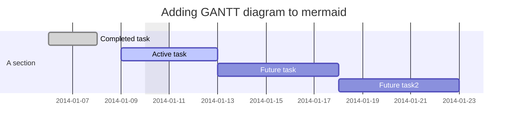
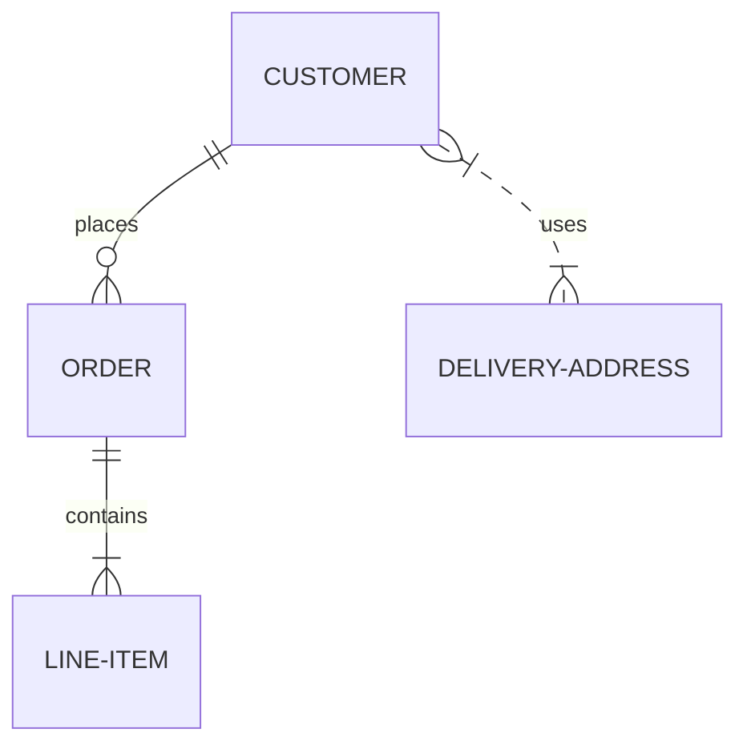
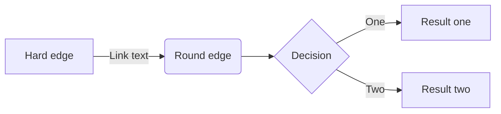

### To do

- [ ] [review flashcards](https://trailhead.salesforce.com/en/content/learn/trails/platform-app-builder-certification-prep?trailmix_creator_id=strailhead&trailmix_slug=prepare-for-your-salesforce-platform-app-builder-credential)
- [x] Node 
- [ ] New Trailhead  
- [x] mermaid flowchart ex.

---

Flocharts in mermaid

 #GANTT

---
 #Entity-diagram

---
 #Flowchart

---

