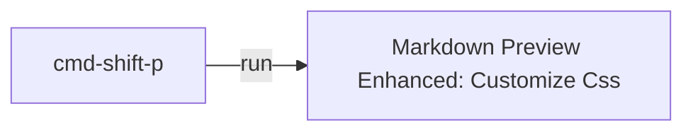

# Dashboard

- [[goals]]
- [[daily.journal]]

* * *

## Incoming event

**Dreamforce**
Thank you for registering for Dreamforce to You 2020.
Your registration ID is R-01486096

Thank you for registering for Dreamforce to You 2020.
Your registration ID is R-01486096

## Tomorrow tasks:

## Should do

Morning
- [x] 30 tests

Afternoon


Evening
- [ ] solve SF business requirements: make a map/diagram
- [ ] this [trail](https://trailhead.salesforce.com/content/learn/modules/isv_plan/isv_plan_app_type)
- [ ] watch [this](https://www.youtube.com/watch?v=yYbrkaW4CgM) on App builder before exam

## Next week task

- [ ] [Business admin Specialist Superbadge: Challange ](https://trailhead.salesforce.com/content/learn/superbadges/superbadge_business_specialist?trailmix_creator_id=strailhead&trailmix_slug=prepare-for-your-salesforce-administrator-credential)

## Recurrent to-do:

- [[tech interview|salesforce-platform.platform-app-builder]]
- [ ] complete trailhead [profile](https://trailblazer.me/id)
- [ ] [weekly review for Kathryn](https://docs.google.com/document/d/1RcVrCH8Ch0T9X_k4-lo5Z8O21agcuhXG_AA9Zsb9CFc/edit)
- [>] #[Computational-thinking](https://www.wolfram.com/wolfram-u/cbm-cause-or-correlation/) course
- [ ] help Lucia to get SF Admin Cert

## career

## Reference:

```
- [ ] : not started
- [w] : work in progress
- [x] : done
- [?] : feedback
- [>] : postponed
```

* * *

How to style MD:



...

<div style="display:flex">
<div class="col2">
<div>Week: 15 Nov</div>
<div> 

- [w][review flashcards - Part 2](<https://trailhead.salesforce.com/en/content/learn/trails/platform-app-builder-certification-prep?trailmix_creator_id=strailhead&trailmix_slug=prepare-for-your-salesforce-platform-app-builder-credential>)
  </div>
  <div>

- [w][Business admin Specialist Superbadge](<https://trailhead.salesforce.com/content/learn/superbadges/superbadge_business_specialist?trailmix_creator_id=strailhead&trailmix_slug=prepare-for-your-salesforce-administrator-credential>)</div>
  </div>

<div class="col2">Week: 22 Nov
<div>

- [ ] [review flashcards](https://trailhead.salesforce.com/en/content/learn/trails/platform-app-builder-certification-prep?trailmix_creator_id=strailhead&trailmix_slug=prepare-for-your-salesforce-platform-app-builder-credential)</div>
  <div>do this</div>
  </div>
  </div>

* * *

Weekly Planner

| Sun | Mon | Tue | Wed | Thur | Fri | Sat |
| --- | --- | --- | --- | ---- | --- | --- |
|     |     |     |     |      |     |     |
|     |     |     |     |      |     |     |
|     |     |     |     |      |     |     |
|     |     |     |     |      |     |     |
|     |     |     |     |      |     |     |
|     |     |     |     |      |     |     |
|     |     |     |     |      |     |     |
|     |     |     |     |      |     |     |

<input type="checkbox"> 

