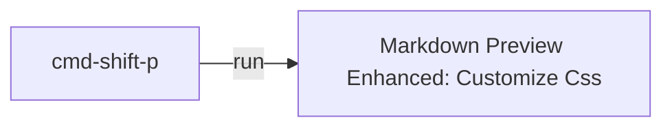

# Dashboard

- [[goals]]
- [[daily.journal]]

---
## Incoming event
**Dreamforce**
Thank you for registering for Dreamforce to You 2020.
Your registration ID is R-01486096

## Tomorrow tasks:
- [ ] New Trailhead  
- [ ] [part 2 review](https://trailhead.salesforce.com/en/content/learn/trails/platform-app-builder-certification-prep?trailmix_creator_id=strailhead&trailmix_slug=prepare-for-your-salesforce-platform-app-builder-credential)
- [ ] [London Trailblazers event](https://u6682178.ct.sendgrid.net/ls/click?upn=v3lFydCCL4vng1LN0PAxPdWFV-2BJGDdyfbd24O-2BGilMylNwi2KyIo-2F-2B6HKjfprteIuQ-2B6JbxVh1euF9l3fNkBCmeGQj2UgNZ-2BjDhGxCmropu-2BWPYWZTkBKxaqZWvfR9I5TGcOPrYh-2FevJ5XDb1rXGUw-3D-3DhDsB_FODTUQdMiBXDK1JRGsAgLhKVtheQ4SBstYL8EXlt1rKMaQ5-2FtCReR2-2FoA6g46JXOGZk6rDvu1QVUyw-2F5-2BhhJT1MGYhV7x8-2Bhyd-2BLo8Nzb7Wv-2BGJrsNKE14adVhL-2F89r2kDJeG-2FTgUczKCYixxobI3igz2yLfDsfPB8rIfkQ2e5kzZQZ0bg8zogEtkOrXD9RxM0RMmJn0hB8gUFnlrqvruZ7ZI1KvcPE-2BdHXF4sSZIkE-3D)  Wed 18 Nov
- [ ] watch [this](https://www.youtube.com/watch?v=yYbrkaW4CgM) on App builder before exam
- [ ] start studying | questions for App Builder

## Next week task
- [ ] [Business admin Specialist Superbadge: Challange ](https://trailhead.salesforce.com/content/learn/superbadges/superbadge_business_specialist?trailmix_creator_id=strailhead&trailmix_slug=prepare-for-your-salesforce-administrator-credential)

## Recurrent to-do:
- [[tech interview|goals.platform-app-builder]]
- [ ] complete trailhead [profile](https://trailblazer.me/id)
- [ ] [weekly review for Kathryn](https://docs.google.com/document/d/1RcVrCH8Ch0T9X_k4-lo5Z8O21agcuhXG_AA9Zsb9CFc/edit)
- [>] #[Computational-thinking](https://www.wolfram.com/wolfram-u/cbm-cause-or-correlation/) course
- [ ] help Lucia to get SF Admin Cert

## career


## Reference:
```
- [ ] : not started
- [w] : work in progress
- [x] : done
- [?] : feedback
- [>] : postponed
```

---

How to style MD:

...
<div style="display:flex">
<div class="col2">
<div>Week: 15 Nov</div>
<div> 

- [w] [review flashcards - Part 2](https://trailhead.salesforce.com/en/content/learn/trails/platform-app-builder-certification-prep?trailmix_creator_id=strailhead&trailmix_slug=prepare-for-your-salesforce-platform-app-builder-credential)
</div>
<div>

- [w] [Business admin Specialist Superbadge](https://trailhead.salesforce.com/content/learn/superbadges/superbadge_business_specialist?trailmix_creator_id=strailhead&trailmix_slug=prepare-for-your-salesforce-administrator-credential)</div>
</div>

<div class="col2">Week: 22 Nov
<div>

- [ ] [review flashcards](https://trailhead.salesforce.com/en/content/learn/trails/platform-app-builder-certification-prep?trailmix_creator_id=strailhead&trailmix_slug=prepare-for-your-salesforce-platform-app-builder-credential)</div>
<div>do this</div>
</div>
</div>

---

Weekly Planner

| Sun  |  Mon | Tue  | Wed  | Thur  | Fri  | Sat  |   
|---|---|---|---|---|---|---|
|   |   |   |   |   |   |   |  
|   |   |   |   |   |   |   |  
|   |   |   |   |   |   |   |
|   |   |   |   |   |   |   |
|   |   |   |   |   |   |   |
|   |   |   |   |   |   |   |
|   |   |   |   |   |   |   |
|   |   |   |   |   |   |   |
<input type="checkbox"> 