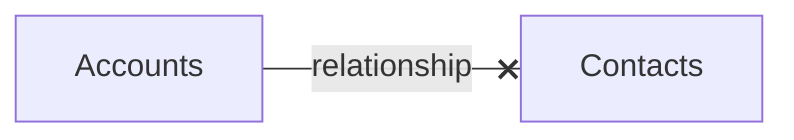

## The main resource for a developer in SF

What is a sandbox?

How you develop in SF?

Using the MVC pattern
==MODEL== -> the databse (schema)
==VIEW== -> the UI
==CONTROLLER== -> the business logic (using declarative or programmatic tools)

 
Know the difference between [[standard-object]] and [[custom-object]]

What is the difference between data and [[metadata]]?

What are relationships and how to use them?

The relationship is defined on the child object using a custom field.
These are the types of relationship fields:
- Master-Detail
- Lookup

What do you need in a many-to-many relationship?

You need a Junction Object

Keys takeways on Objects

- Objects represent database tables that contain your organization's information.
- Objects created by Salesforce are called standard objects. 
- A custom object is an object you create to capture and manage additional data based on your specific business requirements. 
- Object access determines which objects users can view and edit. 
- Record access determines which individual records users can view and edit in each object on which they have been granted appropriate permissions. 
- Standard and custom fields store data on individual records. 
- Create lookup or master-detail relationships to model one-to-many relationships in Salesforce. 
- Use junction objects to model many- to-many relationships.

What can an Object allow you to do?

Objects on the Lightning Platform:
- Provide a predefined set of standard
fields to capture common business
information.
- Allow you to create custom fields
to capture additional business
information.
- Allow you to create custom
relationships to link objects together.
- Allow you to create validation rules
to verify that the data in one or more
fields meets the specified criteria
before the record is saved.
- Allow you to define page layouts and
record types to control what a user
sees when they view or edit a record.
- Allow you to automate business
processes using workflow rules,
processes, flows, and approval
processes.
- Allow you to control record access
and field-level security.

